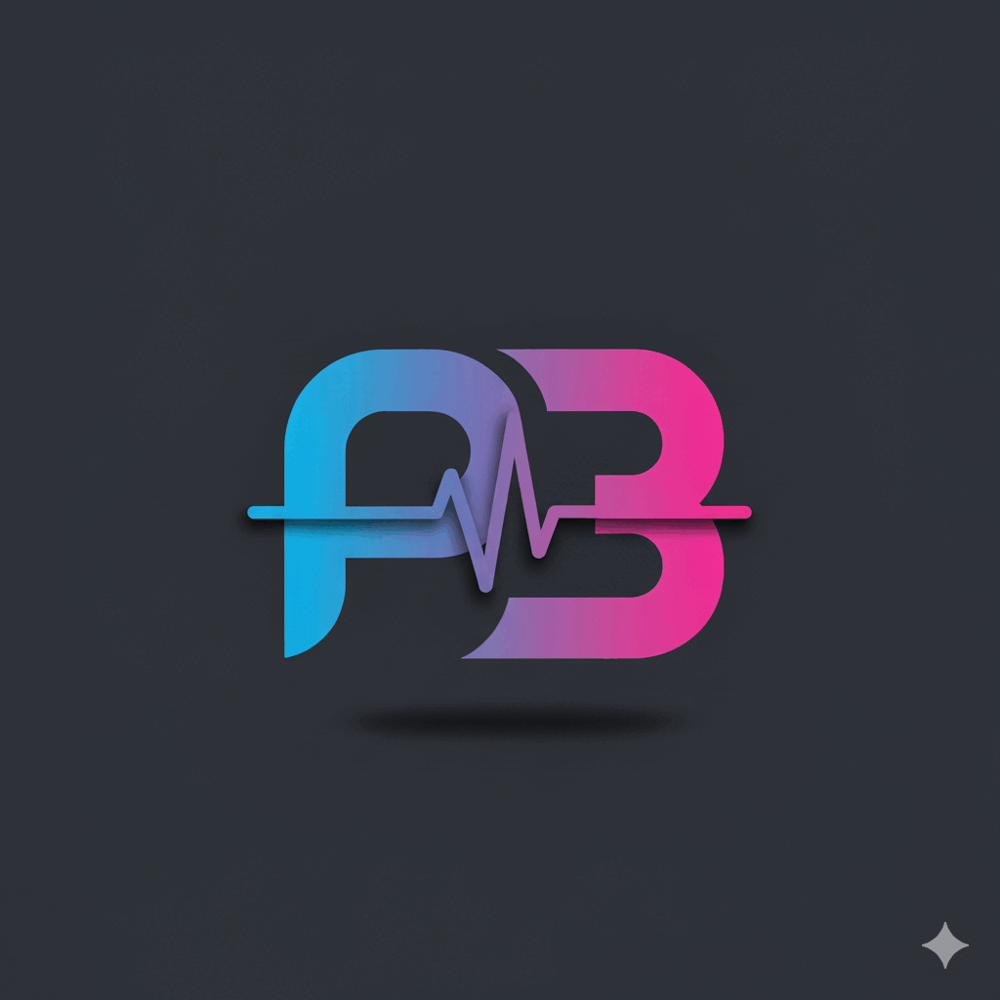

# PulserBot: A Modular Content Delivery Bot for Telegram

<p align="center">
  <a href="https://openxflow.github.io/PulserBot/">
    
  </a>
</p>


<p align="left">
  <strong>Build your own Telegram bot to deliver personalized, multi-theme, and multi-language content on a schedule.</strong>
  <br>
  PulserBot is a flexible, open-source platform designed for easy content management and powerful automation.
  <br>
  PulserBot is Your Personal Content Delivery Engine.
</p>

This repository is a ready-to-use template. Clone it to create a bot that delivers anything you can imagine—from daily philosophical quotes and art history to language lessons and tech news—directly to your friends, family, or community on Telegram. You control the content, the schedule, and the audience.

### Key Features

-   ✨ **Hybrid Architecture:** Combines a static **Web App (Frontend)** for user management with a Python backend for processing.
-   ✨ **User Self-Service:** Users can sign up, verify email, and configure their own subscriptions and timezones via a user-friendly web interface.
-   ✨ **Cloud Database:** Uses **Google Firestore** for secure user data storage and content caching.
-   ✨ **Modular Design:** Built on a clean Handler (Strategy) pattern, allowing you to add new content types without touching the core logic.
-   ✨ **Multi-Language Support:** Deliver content in each user's preferred language.
-   ✨ **Serverless Automation:** Backend runs entirely on **GitHub Actions** (or Render) for reliable, scheduled execution.
-   ✨ **Real-Time Monitoring:** Integrated with **Sentry.io** out-of-the-box for powerful error tracking and logging.
-   ✨ **Extensible:** Easily connect to any API (e.g., Unsplash for images, OpenWeatherMap) or use Google Sheets as a simple content CMS.


### 🛠️ Tech Stack & Powered By

**Frontend:**
-   **HTML5 / CSS3 / jQuery:** Lightweight, static web application hosted on GitHub Pages.
-   **Firebase SDK:** Direct client-side communication with Authentication and Firestore.

**Backend:**
-   **Python 3.11:** Core logic.
-   **GitHub Actions:** CRON-based scheduling and serverless execution.

**Cloud & APIs:**
-   **Google Firebase:** Auth & Firestore Database.
-   **Google Sheets API:** CMS for static content management.
-   **Telegram Bot API:** Message delivery channel.
-   **Groq API (LLM):** AI text generation (Llama 3, Mixtral).
-   **OpenWeatherMap API:** Real-time weather data.
-   **Unsplash API:** High-quality dynamic images.
-   **Cloudinary API:** Secure hosting for personal/family photos.
-   **Sentry:** Error monitoring and performance tracking.

---

### PulserBot delivery :
-   **A moment for yourself, every day.**  PulserBot delivers a daily, thought-provoking message combining art, philosophy, and knowledge to inspire a mindful pause in your routine.
- The content of the message is automated but is fully under your control.
- You can share it with your family and friends, but only you decide what content, when and to whom you send it ...
- Try the real app here: **[YDP (Live)](https://openxflow.github.io/PulserBot/)**
  
<p align="center">
  
</p>

### Quick Start for Developers

1.  **Clone the Repository:**
    ```bash
    git clone https://github.com/OpenXFlow/PulserBot.git
    cd PulserBot
    ```
2.  **Set up the Python Environment:**
    *   Create a virtual environment: `python -m venv .venv`
    *   Activate it: `source .venv/bin/activate` (Linux/macOS) or `.venv\Scripts\activate` (Windows)
    *   Install dependencies: `pip install -r requirements.txt`

3.  **Configure the Services (The "Brain"):**
    *   **Firebase Setup (Crucial):** Create a Firebase project, enable **Authentication** (Email/Password) and **Firestore Database**.
    *   **Security Rules:** Apply the rules from `firestore.rules` in your Firebase Console to protect user data.
    *   **Backend Credentials:** Generate a service account key in Firebase settings, rename it to `credentials.json` and place it in the root directory.
    *   **Frontend Config:** Copy your Firebase Web Config into `webapp/assets/js/firebase-config.js`.
    *   **Environment Variables:** Rename `.env.example` to `.env` and fill in all API keys (Telegram, Groq, Sentry, OpenWeatherMap, Unsplash).

4.  **Configure & Populate Content:**
    *   **Google Sheets:** Create your content spreadsheets (e.g., `BibleEN`, `Rotation`, `FunFacts`).
    *   **Populate Data:** The bot needs data to work! Use the CSV templates provided in **`docs/Google_sheets_exemples/`** to ensure you have the correct columns.
    *   **Important:** Ensure the `used` column is set to `FALSE` for all new rows.
    *   **System Config:** Rename `config.json.example` to `config.json`. Update the `spreadsheet_url` to point to your own Google Sheets.

5.  **Run a Test Job:**
    *   Execute a job for a specific time key defined in your `config.json`:
        ```bash
        python run_once.py time07
        ```


## Full Documentation

All detailed technical information, step-by-step setup guides, and architectural explanations are available at our **[Main Documentation Portal](https://openxflow.github.io/PulserBot/documentation.html)**.

| I'm looking for... | Link to Documentation |
| :--- | :--- |
| **A detailed setup guide** | [→ Setup Guide](https://openxflow.github.io/PulserBot/documentation.html#setup-initial) |
| **Architecture Diagrams** | [→ Diagrams and Data Flow](docs/assets/bot_flow.md) |
| **How to for users** | [→ Create your own Bot, prompt types](docs/how_to/for_users/) |
| **How to for dev** | [→ Flows, Config, etc.](docs/how_to/for_programmers/) |
| **How to pytest** | [→ Pytest, description of testcases ](docs/pytest/) |


## Contributing

Contributions are welcome! If you have ideas for new features, improvements, or bug fixes, feel free to open an issue or submit a pull request.

## License

This project is licensed under the MIT License - see the [LICENSE](LICENSE) file for details.
