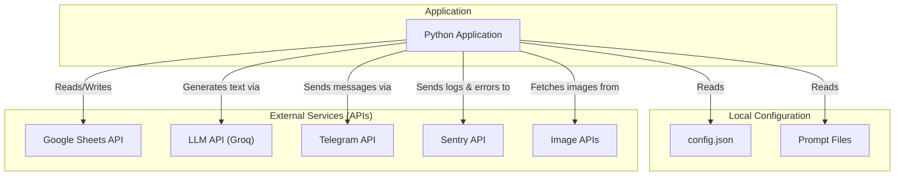
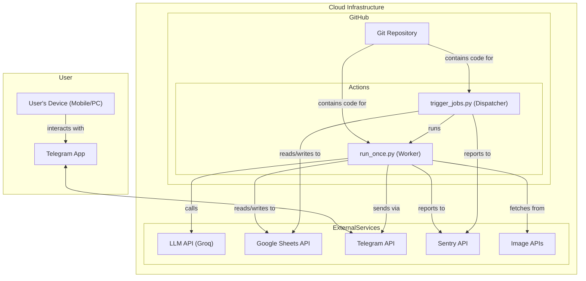
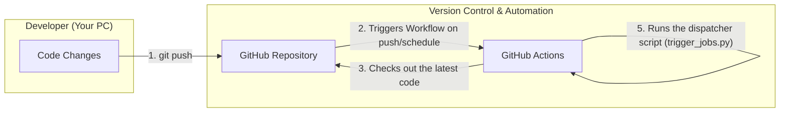
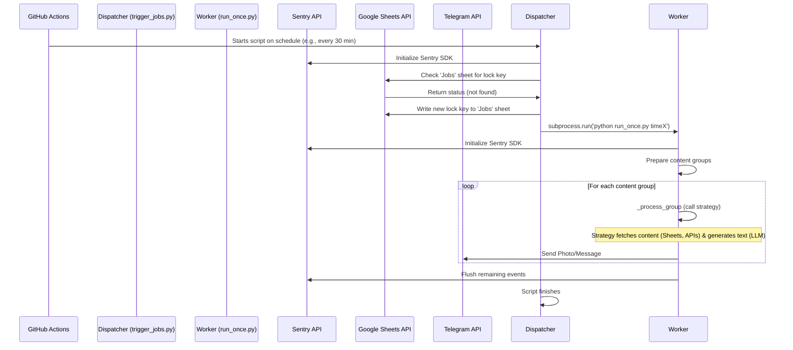

# Architecture and Data Flow: ChronicleBot

This document describes the architecture and detailed data flow of the ChronicleBot application. The goal is to visualize how individual components and external services interact and how the application is deployed.

## Key System Components

-   **GitHub:** Source code repository and the trigger for the automated deployment and execution process.
-   **GitHub Actions:** The core automation engine that runs scheduled jobs.
-   **Application (Python Scripts):** The main Python application, which acts as an orchestrator and set of tools.
-   **Sentry.io:** An external monitoring service that collects errors, logs, and performance metrics in real-time.
-   **Google Sheets API:** An external service used as a persistent content database.
-   **LLM API (e.g., Groq):** An external LLM service that generates creative text.
-   **Telegram API:** The external service through which content is delivered to users.
-   **Image APIs (e.g., Unsplash, Cloudinary):** External services for fetching or hosting images.

---

## 1. Component Architecture Diagram

This diagram shows the main **static building blocks** of the system and their dependencies.



---

## 2. Deployment Diagram

This diagram visualizes **where each software component is deployed** and how they communicate within the real-world infrastructure.



---

## 3. CI/CD Process Diagram (Continuous Integration / Continuous Deployment)

This diagram describes how code changes are automatically deployed and run.



---

## 4. Sequence Diagram: Full Flow from Scheduler to User

This diagram shows the complete **communication over time** between all components of the live application.



---

## 5. Internal Flow Diagram of `JobProcessor`

This diagram illustrates the **logical steps and decisions** within the main `JobProcessor` class, showcasing the Strategy Pattern.

```mermaid
graph TD
    A["Start Job for 'time_key'"] --> B["_prepare_content_groups()"];
    
    subgraph "Parallel Monitoring"
        Sentry["All steps & errors are logged to Sentry"]
    end

    A -- Log --> Sentry

    B --> C{"Are there any subscribed users?"};
    C -- No --> End["End Job"];
    C -- Yes --> D["Group users by (theme, language)"];
    
    D --> E{"Loop: For each group"};
    E -- All groups processed --> End;
    
    E --> F["Get theme_config from config.json"];
    F --> G["_process_group(theme, lang, config)"];
    
    subgraph G
        direction LR
        G1["Get 'type' from config"] --> G2["Dynamically import strategy<br>from 'src/prompt_type/'"];
        G2 --> G3["Call strategy.process()"];
        G3 --> G4["Return (text, image_url)"];
    end

    G --> H{"Content generated?"};
    H -- No --> E;
    H -- Yes --> I["_distribute_content()"];
    I --> J{"Loop: For each user in group"};
    J --> K["Send message via Telegram API"];
    K --> J;
    J -- All users processed --> E;

