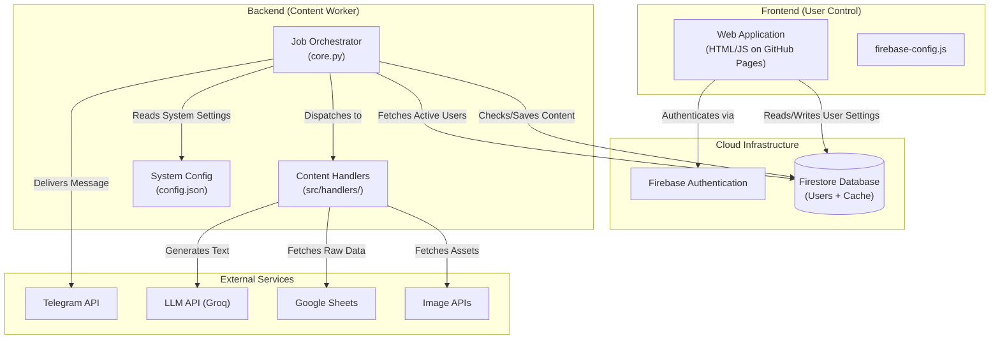
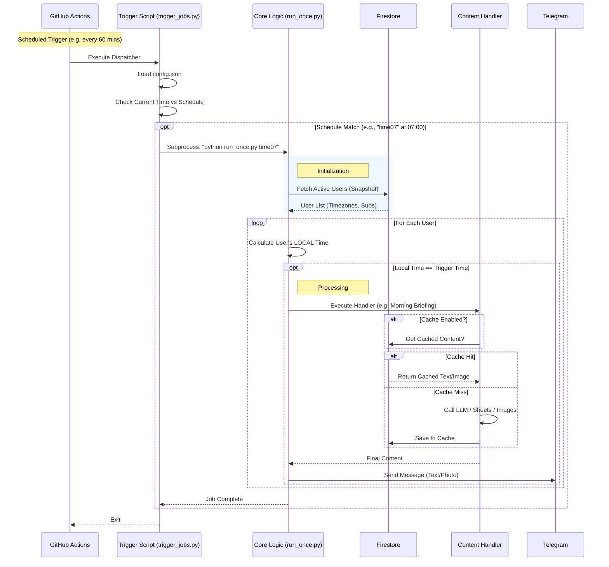
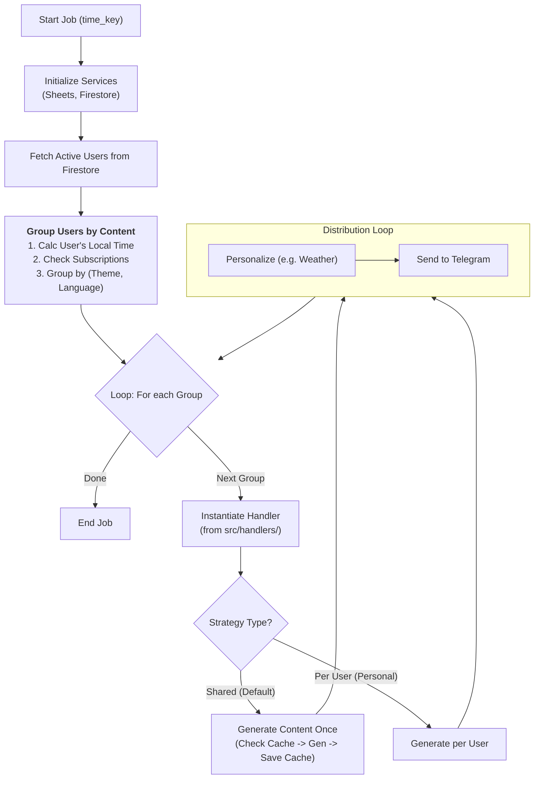

# Architecture and Data Flow: YourDailyPulse (v3.x Hybrid)

This document describes the architecture and detailed data flow of the YourDailyPulse application. It reflects the **Hybrid Architecture** introduced in version 3.0, which decouples user management (Frontend) from content delivery (Backend) using Firebase.

## Key System Components

-   **Frontend (Web App):** A static site hosted on GitHub Pages where users manage settings.
-   **Backend (Python):** The core logic runner, deployed on GitHub Actions (Serverless) or Render (Service).
-   **Firebase (Firestore & Auth):** The central nervous system. Stores user profiles, subscriptions, and caches generated content.
-   **Google Sheets API:** Used as a database for *static content* (e.g., quotes, verses).
-   **LLM API (Groq):** Generates creative text and translations.
-   **Telegram API:** Delivers the final content to the user.
-   **Sentry.io:** Monitors errors and performance.

---

## 1. High-Level Component Architecture

This diagram illustrates how the Frontend and Backend are decoupled and communicate solely through the Cloud Database.


```mermaid
graph TD
    subgraph "Frontend (User Control)"
        WebApp["Web Application<br>(HTML/JS on GitHub Pages)"]
        AuthConfig["firebase-config.js"]
    end

    subgraph "Cloud Infrastructure"
        Auth["Firebase Authentication"]
        DB[("Firestore Database<br>(Users + Cache)")]
    end

    subgraph "Backend (Content Worker)"
        Orchestrator["Job Orchestrator<br>(core.py)"]
        Handlers["Content Handlers<br>(src/handlers/)"]
        Config["System Config<br>(config.json)"]
    end

    subgraph "External Services"
        direction LR
        Telegram["Telegram API"]
        LLM["LLM API (Groq)"]
        Sheets["Google Sheets"]
        Images["Image APIs"]
    end

    %% Flows
    WebApp -- "Authenticates via" --> Auth
    WebApp -- "Reads/Writes User Settings" --> DB
    
    Orchestrator -- "Reads System Settings" --> Config
    Orchestrator -- "Fetches Active Users" --> DB
    Orchestrator -- "Checks/Saves Content" --> DB
    
    Orchestrator -- "Dispatches to" --> Handlers
    Handlers -- "Fetches Raw Data" --> Sheets
    Handlers -- "Generates Text" --> LLM
    Handlers -- "Fetches Assets" --> Images
    
    Orchestrator -- "Delivers Message" --> Telegram
```

---

## 2. Execution Flow: Backend (Serverless)

This sequence diagram details the lifecycle of a job run when triggered by GitHub Actions (cron).


```mermaid
sequenceDiagram
    participant GA as GitHub Actions
    participant Trigger as Trigger Script (trigger_jobs.py)
    participant Core as Core Logic (run_once.py)
    participant DB as Firestore
    participant Handler as Content Handler
    participant TG as Telegram
    
    Note over GA: Scheduled Trigger (e.g. every 60 mins)
    GA->>Trigger: Execute Dispatcher
    Trigger->>Trigger: Load config.json
    Trigger->>Trigger: Check Current Time vs Schedule
    
    opt Schedule Match (e.g., "time07" at 07:00)
        Trigger->>Core: Subprocess: "python run_once.py time07"
        
        rect rgb(240, 248, 255)
            note right of Core: Initialization
            Core->>DB: Fetch Active Users (Snapshot)
            DB-->>Core: User List (Timezones, Subs)
        end
        
        loop For Each User
            Core->>Core: Calculate User's LOCAL Time
            
            opt Local Time == Trigger Time
                note right of Core: Processing
                Core->>Handler: Execute Handler (e.g. Morning Briefing)
                
                alt Cache Enabled?
                    Handler->>DB: Get Cached Content?
                end
                
                alt Cache Hit
                    DB-->>Handler: Return Cached Text/Image
                else Cache Miss
                    Handler->>Handler: Call LLM / Sheets / Images
                    Handler->>DB: Save to Cache
                end
                
                Handler-->>Core: Final Content
                Core->>TG: Send Message (Text/Photo)
            end
        end
        Core-->>Trigger: Job Complete
    end
    Trigger-->>GA: Exit
```

---

## 3. Internal Flow of `JobOrchestrator`

This diagram illustrates the logic inside `src/core.py`, focusing on how users are filtered and how content is generated.


```mermaid
graph TD
    Start["Start Job (time_key)"] --> InitServices["Initialize Services<br>(Sheets, Firestore)"];
    
    InitServices --> FetchUsers["Fetch Active Users from Firestore"];
    
    FetchUsers --> Grouping["<b>Group Users by Content</b><br>1. Calc User's Local Time<br>2. Check Subscriptions<br>3. Group by (Theme, Language)"];
    
    Grouping --> LoopGroups{"Loop: For each Group"};
    
    LoopGroups -- Done --> End["End Job"];
    LoopGroups -- Next Group --> SelectHandler["Instantiate Handler<br>(from src/handlers/)"];
    
    SelectHandler --> CheckStrategy{"Strategy Type?"};
    
    CheckStrategy -- "Shared (Default)" --> GenShared["Generate Content Once<br>(Check Cache -> Gen -> Save Cache)"];
    CheckStrategy -- "Per User (Personal)" --> GenPersonal["Generate per User"];
    
    GenShared --> Distribute["Distribute Async"];
    GenPersonal --> Distribute;
    
    subgraph Distribute ["Distribution Loop"]
        D1["Personalize (e.g. Weather)"] --> D2["Send to Telegram"];
    end
    
    Distribute --> LoopGroups;
```

---

## 4. Data Storage Structure

### Google Sheets (Static Content)
Used for content curation.
-   **Structure:** Rows with columns like `quote`, `author`, `theme`, `used` (boolean).

### Firestore (Dynamic State)
Used for application state.

**Collection: `users`**
```json
{
  "uid": "user_123",
  "email": "user@example.com",
  "timezone": "Europe/Bratislava",
  "subscriptions": {
    "time07": [{ "theme": "morning_briefing_sk", "days": [0,1,2,3,4,5,6] }]
  },
  "weather": { ... }
}
```

**Collection: `daily_content_cache`**
```json
{
  "id": "2025-11-25_morning_briefing_sk",
  "content": {
    "text": "Dobré ráno...",
    "image_url": "https://..."
  },
  "created_at": "timestamp"
}
