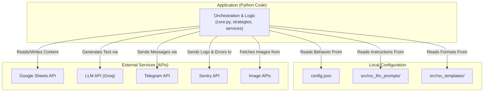
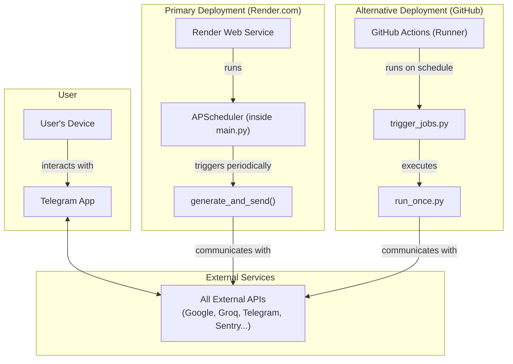
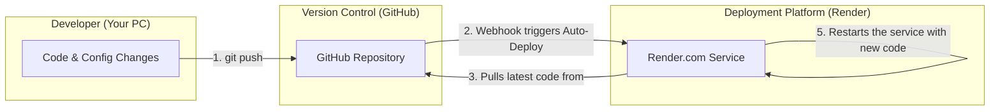
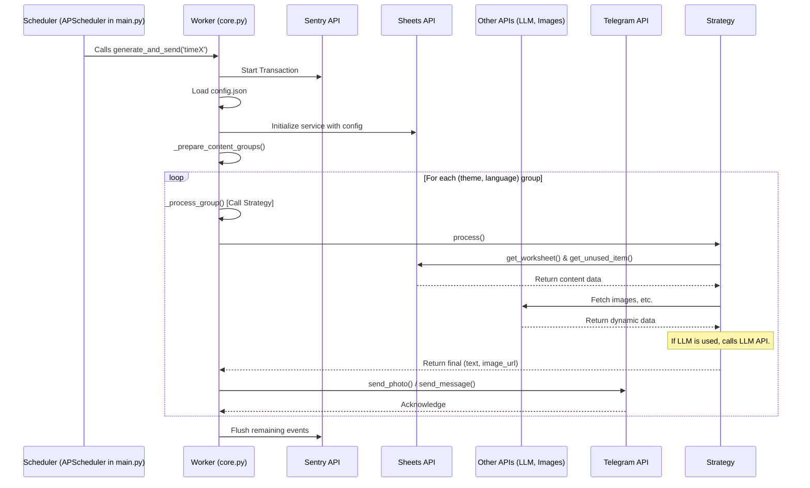

# Architecture and Data Flow: YourDailyPulse

This document describes the architecture and detailed data flow of the YourDailyPulse application. The goal is to visualize how individual components and external services interact and how the application is deployed.

## Key System Components

-   **Deployment Platforms:** Render (primary) or GitHub Actions (alternative).
-   **Application (Python Scripts):** The main Python application, which acts as an orchestrator and set of tools.
-   **Sentry.io:** An external monitoring service that collects errors, logs, and performance metrics in real-time.
-   **Google Sheets API:** An external service used as a persistent content database.
-   **LLM API (e.g., Groq):** An external LLM service that generates creative text.
-   **Telegram API:** The external service through which content is delivered to users.
-   **Image APIs (e.g., Unsplash):** External services for fetching images.

---

## 1. Component Architecture Diagram

This diagram shows the main **static building blocks** of the system and their dependencies.


```mermaid
graph TD
    subgraph "Application (Python Code)"
        App["Orchestration & Logic<br>(core.py, strategies, services)"]
    end

    subgraph "Local Configuration"
        direction LR
        Config["config.json"]
        Prompts["src/rsc_llm_prompts/"]
        Templates["src/rsc_templates/"]
    end

    subgraph "External Services (APIs)"
        direction LR
        GSheets["Google Sheets API"]
        LLM["LLM API (Groq)"]
        Telegram["Telegram API"]
        Sentry["Sentry API"]
        Images["Image APIs"]
    end

    App -- "Reads Behavior From" --> Config
    App -- "Reads Instructions From" --> Prompts
    App -- "Reads Formats From" --> Templates
    App -- "Reads/Writes Content" --> GSheets
    App -- "Generates Text via" --> LLM
    App -- "Sends Messages via" --> Telegram
    App -- "Sends Logs & Errors to" --> Sentry
    App -- "Fetches Images from" --> Images
```

---

## 2. Deployment Architecture Diagram

This diagram visualizes **where each software component is deployed** and how they communicate. It shows both the primary (Render) and alternative (GitHub Actions) deployment models.


```mermaid
graph TD
    subgraph "User"
        UserDevice["User's Device"] -- "interacts with" --> TelegramApp[Telegram App]
    end

    subgraph "Primary Deployment (Render.com)"
        direction TB
        Render["Render Web Service"]
        Scheduler["APScheduler (inside main.py)"]
        WorkerA["generate_and_send()"]
        Render -- "runs" --> Scheduler
        Scheduler -- "triggers periodically" --> WorkerA
    end

    subgraph "Alternative Deployment (GitHub)"
        direction TB
        GHA["GitHub Actions (Runner)"]
        Dispatcher["trigger_jobs.py"]
        WorkerB["run_once.py"]
        GHA -- "runs on schedule" --> Dispatcher
        Dispatcher -- "executes" --> WorkerB
    end

    subgraph "External Services"
        ExternalAPIs["All External APIs<br>(Google, Groq, Telegram, Sentry...)"]
    end

    TelegramApp <--> ExternalAPIs
    WorkerA -- "communicates with" --> ExternalAPIs
    WorkerB -- "communicates with" --> ExternalAPIs
```

---

## 3. CI/CD Process Diagram (Continuous Integration / Continuous Deployment)

This diagram describes how code changes are automatically deployed to the Render platform.


```mermaid
graph LR
    subgraph "Developer (Your PC)"
        A["Code & Config Changes"]
    end

    subgraph "Version Control (GitHub)"
        B["GitHub Repository"]
    end
    
    subgraph "Deployment Platform (Render)"
        C["Render.com Service"]
    end

    A -- "1. git push" --> B
    B -- "2. Webhook triggers Auto-Deploy" --> C
    C -- "3. Pulls latest code from" --> B
    C -- "4. Installs dependencies" --> C
    C -- "5. Restarts the service with new code" --> C
```

---

## 4. Sequence Diagram: Primary Flow (Render with APScheduler)

This diagram shows the complete **communication over time** between all components in the primary deployment model.


```mermaid
sequenceDiagram
    participant Scheduler as Scheduler (APScheduler in main.py)
    participant Worker as Worker (core.py)
    participant Sentry as Sentry API
    participant Sheets as Sheets API
    participant Other as Other APIs (LLM, Images)
    participant Telegram as Telegram API
    participant Strategy

    Scheduler->>Worker: Calls generate_and_send('timeX')
    
    Worker->>Sentry: Start Transaction
    Worker->>Worker: Load config.json
    Worker->>Sheets: Initialize service with config
    Worker->>Worker: _prepare_content_groups()
    
    loop For each (theme, language) group
        Worker->>Worker: _process_group() [Call Strategy]
        
        Worker->>Strategy: process()
        Strategy->>Sheets: get_worksheet() & get_unused_item()
        Sheets-->>Strategy: Return content data
        Strategy->>Other: Fetch images, etc.
        Other-->>Strategy: Return dynamic data
        Note over Strategy: If LLM is used, calls LLM API.
        Strategy-->>Worker: Return final (text, image_url)
        
        Worker->>Telegram: send_photo() / send_message()
        Telegram-->>Worker: Acknowledge
    end
    
    Worker->>Sentry: Flush remaining events
```

---

## 5. Internal Flow Diagram of `JobProcessor`

This diagram illustrates the **logical steps and decisions** within the main `JobProcessor` class, showcasing the Strategy Pattern.

```mermaid
graph TD
    A["Start Job for 'time_key'"] --> B["Load config.json"];
    
    B --> B_INIT["Initialize Services<br>(e.g., sheets_service.initialize_sheets_service)"];
    B_INIT --> C["_prepare_content_groups()"];
    
    subgraph "Parallel Monitoring"
        Sentry["All steps & errors are logged to Sentry"]
    end

    A -- Log --> Sentry

    C --> D{"Are there any subscribed users?"};
    D -- No --> End["End Job"];
    D -- Yes --> E["Group users by (theme, language)"];
    
    E --> F{"Loop: For each group"};
    F -- All groups processed --> End;
    
    F --> G["Get theme_config from config.json"];
    G --> H["_process_group(theme, lang, config)"];
    
    subgraph H ["Strategy Dispatch"]
        direction LR
        H1["Get 'type' from config"] --> H2["Dynamically import strategy<br>from 'src/prompt_type/'"];
        H2 --> H3["Call strategy.process()"];
        H3 --> H4["Return (text, image_url)"];
    end

    H --> I{"Content generated?"};
    I -- No --> F;
    I -- Yes --> J["_distribute_content()"];
    J --> K{"Loop: For each user in group"};
    K --> L["Send message via Telegram API"];
    L --> K;
    K -- All users processed --> F;

