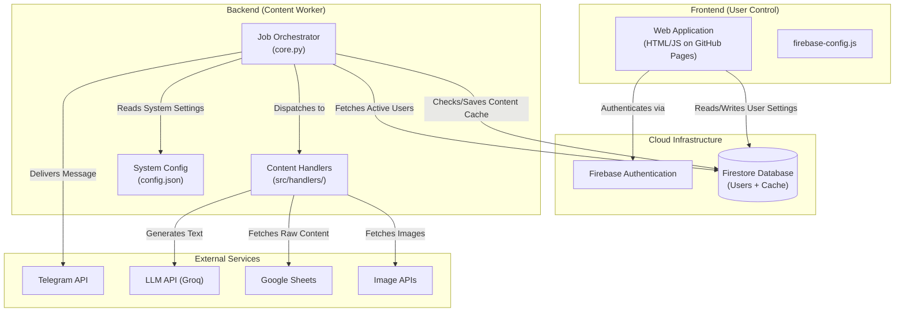
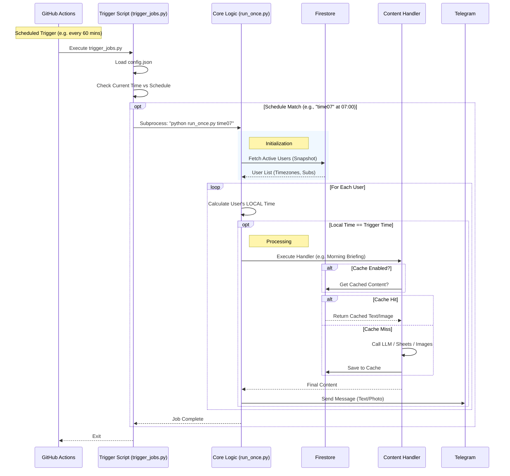
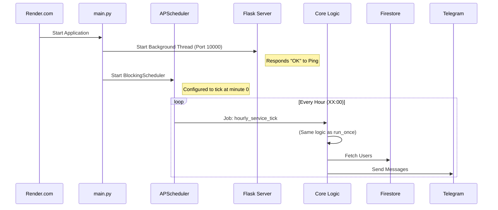

--- START OF FILE 00_architecture.md ---

# Architecture and Data Flow: YourDailyPulse (Hybrid Firebase Edition)

This document describes the architecture of the YourDailyPulse application in its version 3.x. This version introduces a **Hybrid Architecture** that decouples the user interface (Frontend) from the processing logic (Backend) using cloud infrastructure.

## Key System Components

-   **Frontend (Web App):** A static HTML/JS application hosted on **GitHub Pages**. It serves as the control panel where users register, log in, and configure their subscriptions.
-   **Cloud Infrastructure (Firebase):**
    -   **Authentication:** Handles user sign-up, login, and email verification securely.
    -   **Firestore Database:** The central source of truth. It stores user profiles, subscriptions, settings, and the daily content cache.
-   **Backend (Python Core):** The logic engine responsible for generating and delivering content. It supports two runtime modes:
    -   **Serverless (GitHub Actions):** Runs periodically via `run_once.py` (triggered by CRON) to minimize costs.
    -   **Service (Render):** Runs continuously via `main.py` with an internal scheduler.
-   **External APIs:** Telegram (delivery), Groq (LLM generation), Google Sheets (static content source), Unsplash (images).

---

## 1. High-Level Component Architecture

This diagram illustrates how the Frontend and Backend are decoupled and communicate solely through the Cloud Database.

---

## 2. Execution Flow: Backend (Serverless / GitHub Actions)

This is the standard execution mode triggered by a CRON schedule (e.g., every hour).

---

## 3. Execution Flow: Backend (Service / Render)

This mode uses `main.py` as a persistent service.

--- END OF FILE 00_architecture.md ---
