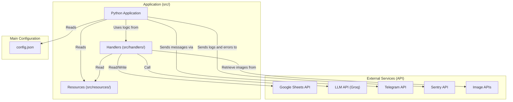
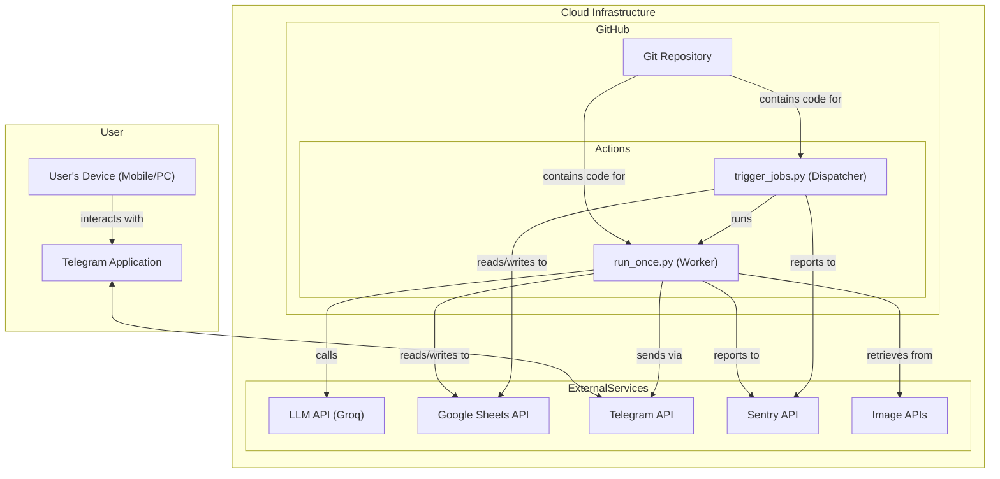
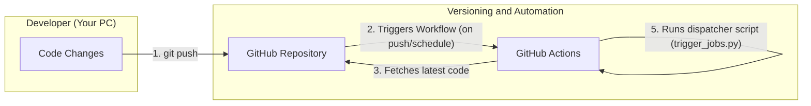
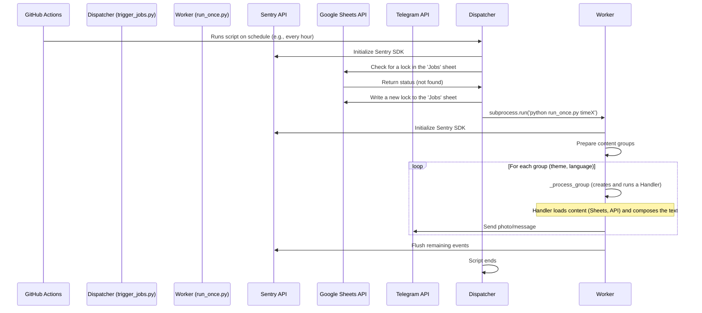
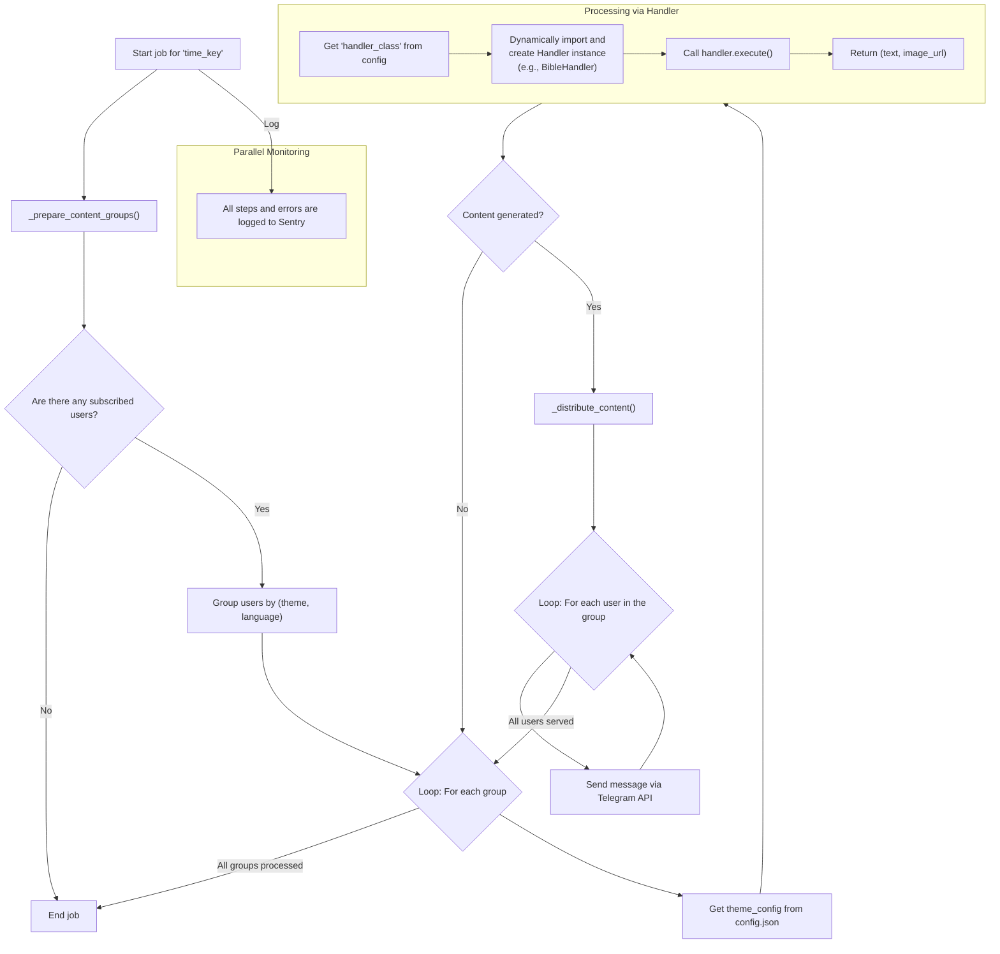

# Architecture and Data Flow: YourDailyPulse

This document describes the architecture and detailed data flow of the YourDailyPulse application. The goal is to visualize how individual components and external services work together and how the application is deployed.

## Key System Components

-   **GitHub:** Source code repository and the trigger for the automated deployment and execution process.
-   **GitHub Actions:** The primary automation tool that runs scheduled tasks.
-   **Application (Python Scripts):** The main Python application, which acts as an orchestrator and a set of tools.
-   **Sentry.io:** An external monitoring service that collects errors, logs, and performance metrics in real time.
-   **Google Sheets API:** An external service used as a persistent database for content.
-   **LLM API (e.g., Groq):** An external LLM service that generates creative text for specific topics.
-   **Telegram API:** An external service through which content is delivered to users.
-   **Image APIs (e.g., Unsplash, Cloudinary):** External services for retrieving or hosting images.

---

## 1. Component Architecture Diagram

This diagram shows the main **static building blocks** of the system and their dependencies.

---

## 2. Deployment Diagram

This diagram visualizes **where each software component is deployed** and how they communicate within the real infrastructure.

---

## 3. CI/CD Process Diagram (Continuous Integration / Continuous Deployment)

This diagram describes how code changes are automatically deployed and executed.

---

## 4. Sequence Diagram: Complete Flow from Scheduler to User

This diagram shows the complete **communication over time** between all components of the live application.

---

## 5. Internal Flow Diagram of `JobProcessor` (Handler Pattern)

This diagram illustrates the **logical steps and decisions** within the main `JobProcessor` class, highlighting the use of the new "Handler" design pattern.

