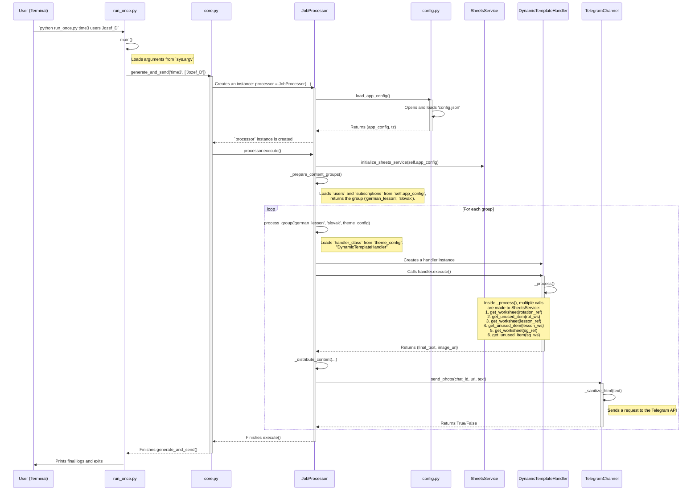

### Sequence Diagram: Complete Flow of the `run_once.py time3 users Jozef_D` Command

This diagram illustrates in detail the calls between the main files and classes, using the `german_lesson` theme as an example to demonstrate the most interesting logic.

