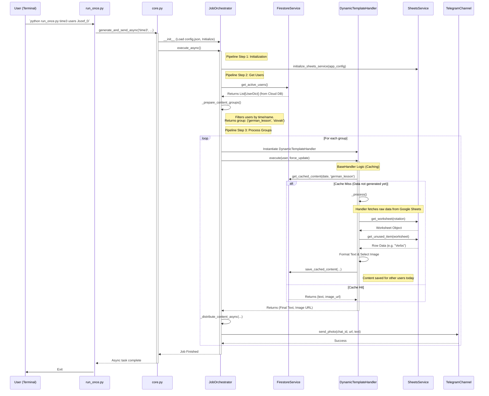

### 1. `01_run_once_flow.md`
*Zmeny: Aktualizovaný názov triedy na `JobOrchestrator`, pridané volanie `firestore_service` na získanie používateľov a ukážka, ako sa pre tému 'german_lesson' (ktorá je dynamická) preskočí globálna cache, ak je tak nastavená, alebo sa použije.*

--- START OF FILE 01_run_once_flow.md ---

### Sequence Diagram: Complete Flow of the `run_once.py` Command

This diagram illustrates in detail the calls between the main python classes during a manual CLI execution (e.g., `python run_once.py time3 users Jozef_D`).

It uses the **`german_lesson`** theme as an example to demonstrate the interaction between the Orchestrator, Firestore, and the Template Handler.

--- END OF FILE 01_run_once_flow.md ---

