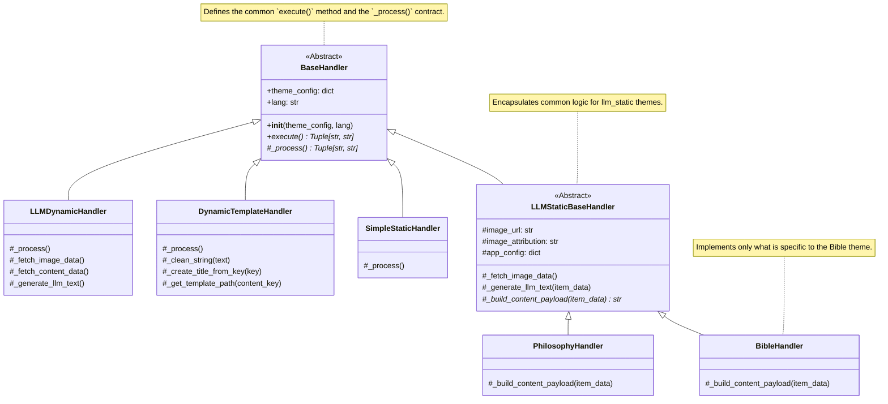

# Handler Architecture and Interfaces

This document describes the object-oriented architecture of "Handlers," which are responsible for the content generation logic for individual themes. It explains the inheritance system and the "contracts" that handlers must fulfill.

This is a key document for developers who want to understand how the system works under the hood or how to add a completely new type of theme.

---

## 1. Class Inheritance Diagram

All handlers in the system share a common ancestor and are organized into a logical inheritance tree. This ensures code consistency and reusability.



---

## 2. Description of Base Classes

### `BaseHandler` (in `_base/base_handler.py`)

This is the **root abstract class** for all handlers. It defines the basic "contract" and common behavior.

-   **Purpose:** To ensure that every handler has the same structure and a central point for execution and error handling.
-   **Key Methods:**
    -   `__init__(self, theme_config, lang)`: A common constructor that stores the theme configuration and language.
    -   `execute(self) -> Tuple[str, str]`: The **final public method** called by `core.py`. Its sole responsibility is to call the internal `_process` method and wrap it in a `try...except` block. This ensures that an error in one handler does not crash the entire application.
    -   `_process(self) -> Tuple[str, str]`: An **abstract method**. This is the "contract." Every concrete class (like `SimpleStaticHandler` or `BibleHandler`) **must** implement this method and place its unique content generation logic within it.

### `LLMStaticBaseHandler` (in `_base/llm_static_base.py`)

This class **inherits from `BaseHandler`** and serves as a common foundation for all handlers that use static data and an LLM (e.g., `BibleHandler`, `PhilosophyHandler`).

-   **Purpose:** To encapsulate and share all code that is identical for `llm_static` themes, avoiding duplication.
-   **Inherited Logic (`_process` method):** This class implements the `_process` method, which contains the complete, common algorithm:
    1.  Fetch the image (`_fetch_image_data`).
    2.  Connect to the Google Sheet and fetch an unused row (`sheets_service.get_unused_item`).
    3.  Call the LLM to generate the text (`_generate_llm_text`).
    4.  Mark the row as used (`sheets_service.mark_item_as_used`).
-   **New Contract (`_build_content_payload`):**
    -   Since each `llm_static` theme needs to format data for the LLM slightly differently, this class defines a new abstract method `_build_content_payload(self, item_data)`.
    -   Concrete, final classes like `BibleHandler` or `PhilosophyHandler` then only need to implement this single, small method, where they define exactly how the text "payload" for the prompt should be created from the data (`item_data`).

---

## 3. How to Add a New Handler (Example)

If we wanted to add a completely new type of theme, for example, a "Daily Joke" that works similarly to `bible_sk` (data in a sheet + LLM for rephrasing):

1.  **Create a new file:** `src/handlers/llm/joke_handler.py`.
2.  **Create a new class** that inherits from `LLMStaticBaseHandler`.
3.  **Implement the single required method** `_build_content_payload`:
    ```python
    from .._base.llm_static_base import LLMStaticBaseHandler

    class JokeHandler(LLMStaticBaseHandler):
        def _build_content_payload(self, item_data: dict) -> str:
            joke_text = item_data.get("joke", "")
            punchline = item_data.get("punchline", "")
            return f"- Joke: {joke_text}\n- Punchline: {punchline}"
    ```
4.  **Register the new handler** in `config.json` and in the `HANDLER_MAP` in `core.py`.

That's it. All other work is handled by the inherited methods.
