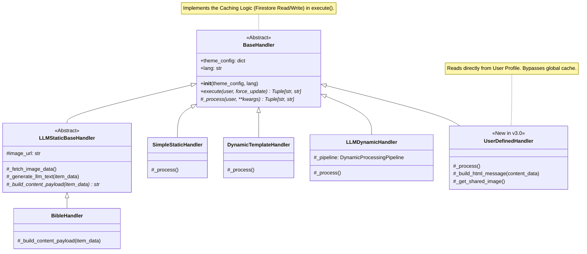

--- START OF FILE 03_handler_interfaces.md ---

# Handler Architecture and Interfaces (v3.0)

This document describes the object-oriented architecture of "Handlers," which are responsible for the content generation logic for individual themes.

In **v3.0**, the `BaseHandler` has been upgraded to act as a **Caching Proxy**, automatically interfacing with Firestore to save API costs.

---

## 1. Class Inheritance Diagram

All handlers inherit from `BaseHandler`, which enforces a consistent interface and handles the caching lifecycle.



---

## 2. Description of Base Classes

### `BaseHandler` (in `_base/base_handler.py`)

The **root abstract class**. It manages the lifecycle of a request.

-   **`execute(self, user, force_update)` -> Tuple[str, str]**:
    -   This is the **public entry point**.
    -   **Caching Logic:**
        1.  Checks `config.json` if caching is enabled for this theme.
        2.  If yes, calls `firestore_service.get_cached_content`. Returns immediately on hit.
        3.  If miss, calls `self._process()`.
        4.  Saves the result to `firestore_service.save_cached_content`.
    -   **Error Handling:** Wraps everything in a try/except block to prevent crashes.

-   **`_process(self, user, **kwargs)` -> Tuple[str, str]**:
    -   The **Abstract Contract**. Concrete handlers implement their specific logic here (calling APIs, parsing sheets).

---

### `UserDefinedHandler` (in `template/user_defined_handler.py`)

A specialized handler for the **"User Reminder"** theme.

-   **Purpose:** To generate content that is unique to every single user (defined in their Frontend dashboard).
-   **Logic:**
    -   It does **NOT** use the global text cache (strategy: `per_user`).
    -   It reads `custom_content` (blocks of text, links) directly from the passed `user` object.
    -   **Image Optimization:** Uses a unique `_get_shared_image()` method which *does* cache the image globally for the day, preventing 1000 API calls to Unsplash if 1000 users have reminders.

### `LLMDynamicHandler` (in `llm/llm_dynamic_handler.py`)

Refactored in v3.0 to use a **Pipeline Pattern**.

-   Instead of a monolithic method, it breaks down the generation of complex briefings (like *Morning Briefing*) into small steps: `DateProvider`, `WeatherProvider`, `DailyGreetingProvider`, etc.
-   This makes it easier to maintain and test individual components of the briefing.

---

## 3. How to Add a New Handler

To add a new theme type (e.g., "Daily Joke"):

1.  **Create File:** `src/handlers/llm/joke_handler.py`.
2.  **Inherit:** From `LLMStaticBaseHandler` (if using LLM) or `BaseHandler`.
3.  **Implement `_process` (or `_build_content_payload`):**
    ```python
    class JokeHandler(LLMStaticBaseHandler):
        def _build_content_payload(self, item_data: dict) -> str:
            return f"Tell a joke about: {item_data['topic']}"
    ```
4.  **Register:** Add to `HANDLER_MAP` in `src/core.py`.

--- END OF FILE 03_handler_interfaces.md ---
