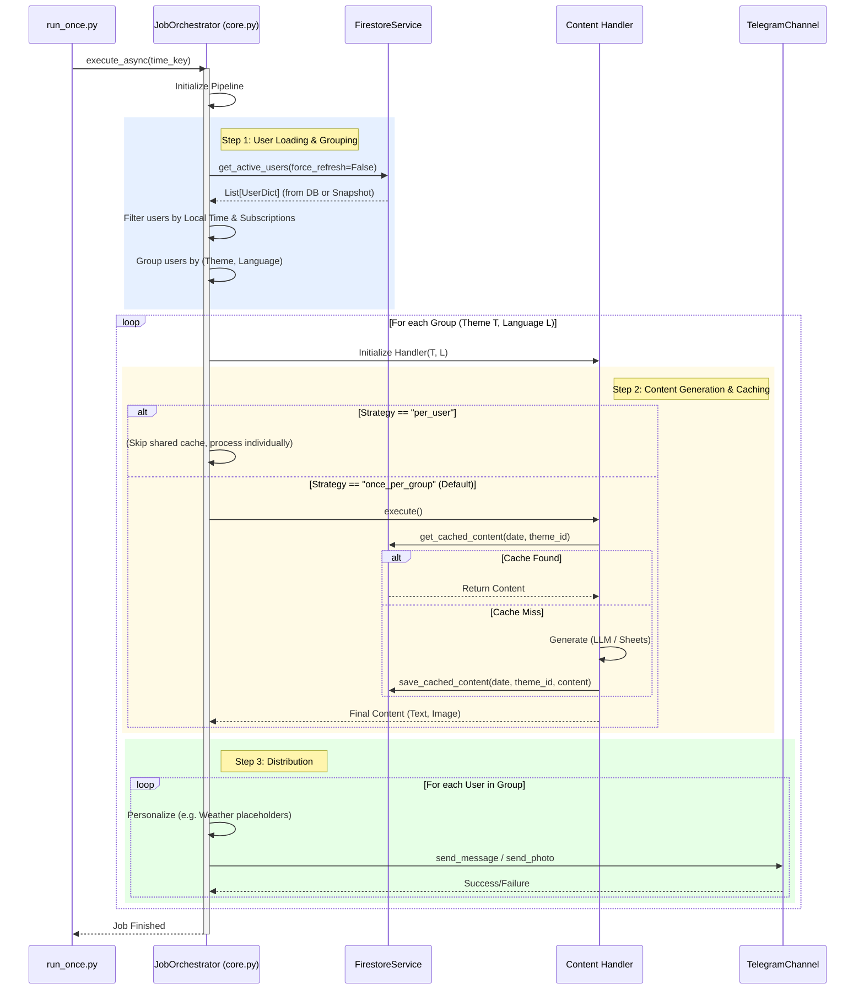

--- START OF FILE 04_job_procesor_details.md ---

# Detailed Logic: Job Processor & Data Flow

This document details the internal logic of the `core.py` module, specifically the `JobOrchestrator` (formerly JobProcessor). It highlights the interactions with the new **Firestore Service** and the **Content Caching** mechanism.

---

## 1. Core Execution Sequence Diagram

This diagram shows exactly what happens when `run_once.py` calls `generate_and_send_async()`.

## 2. Key Logic Changes in v3.0

### A. User Loading (Hybrid Model)
Unlike v2.0, `core.py` no longer relies on `config.json` for user data.
-   It calls `firestore_service.get_active_users()`.
-   This service implements a **Daily Snapshot Strategy**: It downloads all users once per day and caches them in a special `system_cache` collection in Firestore to reduce read costs.

### B. Content Caching
To save money on LLM (Groq) and Image (Unsplash) APIs, the system now checks Firestore before generating content.
-   **Cache Key:** `YYYY-MM-DD_{theme_id}` (e.g., `2025-11-25_morning_briefing_sk`).
-   **Behavior:**
    1.  Handler checks if a document with this ID exists in the `daily_content_cache` collection.
    2.  **If yes:** Returns the stored text and image URL immediately.
    3.  **If no:** Calls LLM/Sheets/Unsplash, generates content, and **saves** it to Firestore for the next execution.

### C. Processing Strategy
Themes can now define a `processing_strategy` in `config.json`:
-   **`once_per_group` (Default):** Generates content ONCE (and caches it), then sends the same content to all subscribed users. Used for generic themes (Bible, Philosophy).
-   **`per_user`:** Generates unique content for EVERY user. Caching is usually disabled (`use_cache: false`). Used for `user_reminder` or highly personalized briefings.

--- END OF FILE 04_job_procesor_details.md ---