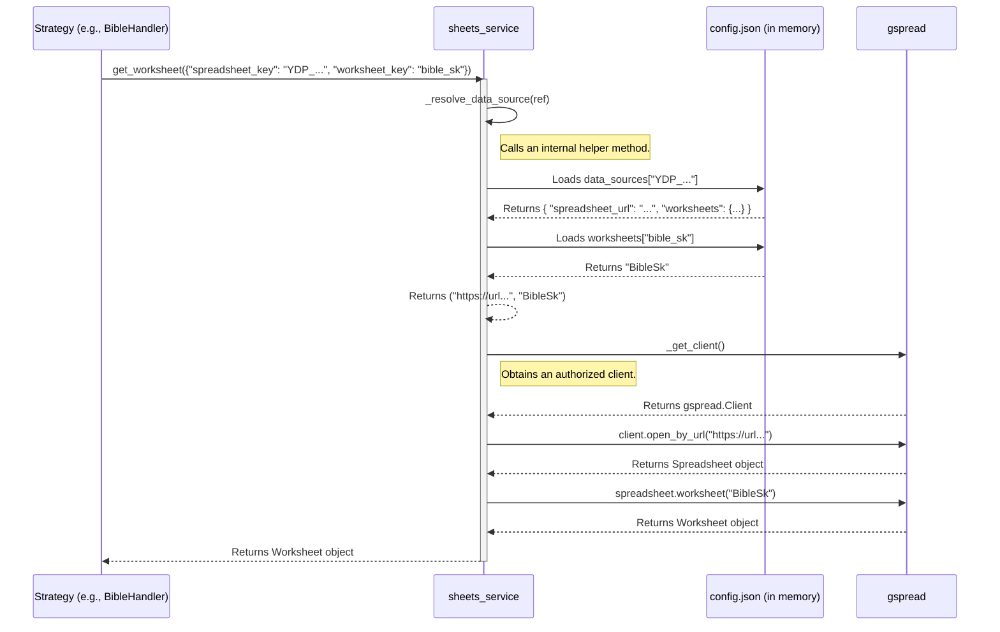
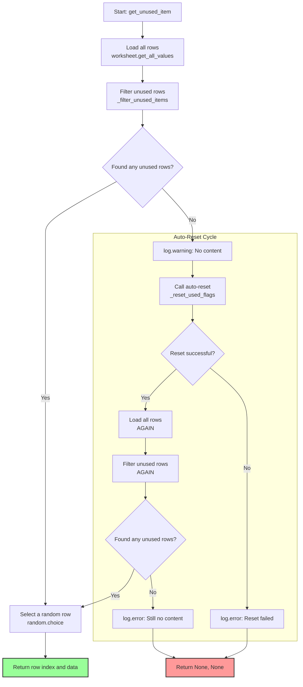

# Detailed Logic: `sheets_service.py`

This document provides an in-depth look at the internal logic of the `sheets_service.py` module, which is responsible for all communication with the Google Sheets API. It is intended for developers who need to understand exactly how data loading, reference resolution, and automatic content resetting work.

---

## 1. Main Public Functions (Module API)

Other parts of the application communicate with the service exclusively through these four functions:

-   **`initialize_sheets_service(app_config)`**: Must be called at the beginning of each run. It sets the global `app_config` for internal use within the service.
-   **`get_worksheet(data_source_ref)`**: The main entry point for obtaining a `Worksheet` object. It takes a reference dictionary from `config.json` as a parameter.
-   **`get_unused_item(worksheet, language)`**: Retrieves one random, unused row from the given sheet.
-   **`mark_item_as_used(worksheet, row_index)`**: Marks a specific row as used.

---

## 2. Data Flow for Retrieving a Sheet (`get_worksheet`)

The `get_worksheet` method is crucial because it translates abstract references into concrete objects.

## 3. Detailed Flow of the `get_unused_item` Function (with Auto-Reset)

This is the most complex and important function in the module. Its robustness ensures the smooth and maintenance-free operation of the application.

**Key points of the algorithm:**
1.  **First Attempt:** The function first tries to find any rows where the `used` column is set to `FALSE`.
2.  **Success Path:** If it finds at least one such row, it randomly selects one and returns its data and index.
3.  **Failure Path (Triggering Auto-Reset):** If it finds no unused rows, "Plan B" is executed:
    a.  The internal method `_reset_used_flags` is called, which sets the `used` column back to `FALSE` for all relevant rows.
    b.  **Second Attempt:** After a successful reset, the function **attempts to load and filter the data one more time**. This is a critical step that ensures the application can seamlessly continue into a new cycle.
    c.  If it still finds no data after the reset (which could only happen with an empty sheet), it logs a critical error and terminates.