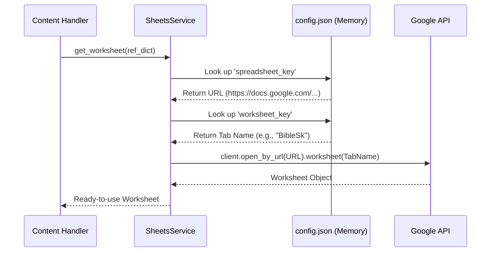
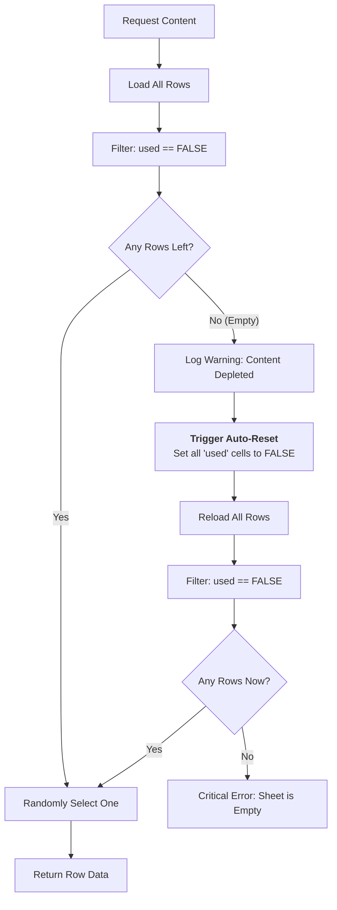

--- START OF FILE 05_service_sheets.md ---

# Detailed Logic: Google Sheets Service (Content DB)

This document details the `sheets_service.py` module. In the **Hybrid v3.0 Architecture**, this service acts as the interface for the **Static Content Database**.

**Distinction:**
-   **Firestore:** Stores *Users*, *Subscriptions*, and *Daily Cache*.
-   **Google Sheets:** Stores *Source Content* (Quotes, Verses, Lesson definitions) managed by humans.

---

## 1. Service Responsibility

The `SheetsService` is responsible for:
1.  **Authentication:** Managing the connection to Google APIs using `credentials.json` (passed securely via GitHub Secrets).
2.  **Reference Resolution:** Converting logical IDs (e.g., `bible_sk`) from `config.json` into actual Spreadsheet URLs and Worksheet names.
3.  **Content Rotation:** Selecting unused content rows and handling the **Auto-Reset** logic when content runs out.

---

## 2. Main Public API

Handlers communicate with this service via these four functions:

-   **`initialize_sheets_service(app_config)`**:
    -   Called once at startup by `JobOrchestrator`.
    -   Loads the `data_sources` map from `config.json`.
-   **`get_worksheet(data_source_ref)`**:
    -   Resolves a dictionary like `{"spreadsheet_key": "...", "worksheet_key": "..."}` into a live `gspread.Worksheet` object.
-   **`get_unused_item(worksheet, language)`**:
    -   The core logic. Returns a random row where `used == FALSE`.
-   **`mark_item_as_used(worksheet, row_index)`**:
    -   Updates the `used` column to `TRUE` and writes the current timestamp.

---

## 3. Logic Flow: resolving `get_worksheet`

This diagram shows how abstract configuration keys translate to physical data connections.

---

## 4. Critical Logic: Content Selection & Auto-Reset

The `get_unused_item` function ensures the bot **never stops working**, even if it runs out of new quotes.

### The Auto-Reset Mechanism
1.  **Detection:** When the bot filters rows and finds that 0 rows remain unused.
2.  **Action:** It iterates through the entire sheet and sets the `used` column to `FALSE` for every row that matches the language criteria.
3.  **Seamless Recovery:** It immediately retries the selection process in the same execution. The user never notices that the content pool was exhausted; they simply start seeing older content again (rotation).

--- END OF FILE 05_service_sheets.md ---
