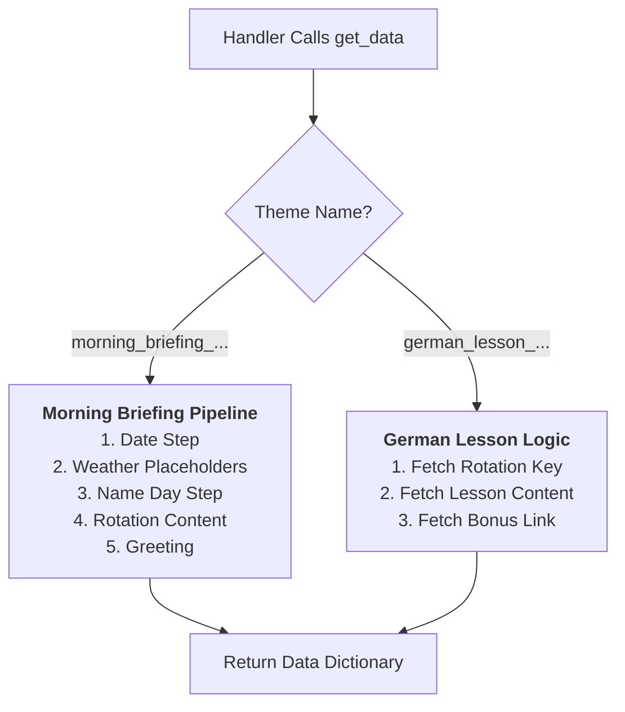
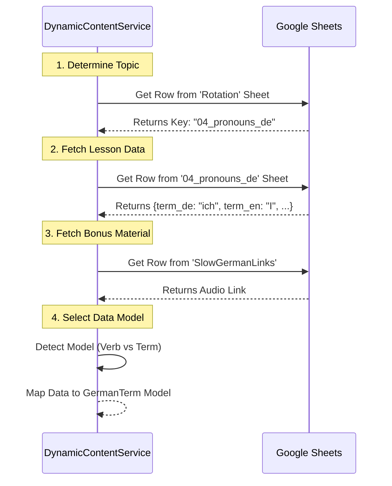

--- START OF FILE 06_service_dynamic_content.md ---

# Detailed Logic: Dynamic Content Service

This document details the `dynamic_content_service.py` module. This service acts as a **Data Composer** for complex themes (`morning_briefing`, `german_lesson`) that require aggregation from multiple sources before being sent to the LLM.

**Role in v3.0 Architecture:**
-   It runs **synchronously** inside the Handler.
-   It prepares the **Data Payload** for the prompt.
-   It inserts **Placeholders** for data that requires async fetching (like Weather), which are resolved later by the Orchestrator.

---

## 1. Service Architecture: The Pipeline Pattern

Unlike simple themes where we just grab one row from a sheet, complex themes require a sequence of steps. The service implements a **Pipeline** for each theme type.

---

## 2. Morning Briefing Logic (Per-User)

The Morning Briefing is generated with a `per_user` strategy. This means the service receives the specific **User Object** (from Firestore) and customizes the data payload.

### The Composition Steps:

1.  **DateProvider:** Formats the current date based on the theme's locale (SK/EN).
2.  **WeatherPlaceholder:**
    -   Reads `user['weather']['locations']`.
    -   Does **NOT** call the Weather API (that would be slow and blocking).
    -   Instead, it generates specific placeholders: `{USER_WEATHER_LOCATION_0}`, `{USER_WEATHER_FORECAST_0}`.
    -   *Note: The Orchestrator (`core.py`) fills these in asynchronously just before sending.*
3.  **DailyInfoProvider:** Fetches Name Days (Meniny) and International Days from the `meniny_sk` Google Sheet.
4.  **RotatingContent:**
    -   Checks the `Rotation` sheet to see what topic is scheduled for today (e.g., "Quotes" or "History").
    -   Fetches content from the specific sheet (e.g., `Quotes`).
    -   **Optimization:** Marks the content as used only once per day globally, even if 100 users trigger it.
5.  **DailyGreeting:** Fetches a random greeting in a foreign language (e.g., Swahili) to end the message.

---

## 3. German Lesson Logic (Dynamic Template)

This logic is unique because it doesn't just fill a prompt; it determines **which template** to use.

### Why this complexity?
German verbs have different data structures (conjugations) than nouns (plurals). The service dynamically detects the content type and prepares the correct data structure so the `DynamicTemplateHandler` knows which text template (`verbs` vs `other`) to load.

--- END OF FILE 06_service_dynamic_content.md ---
