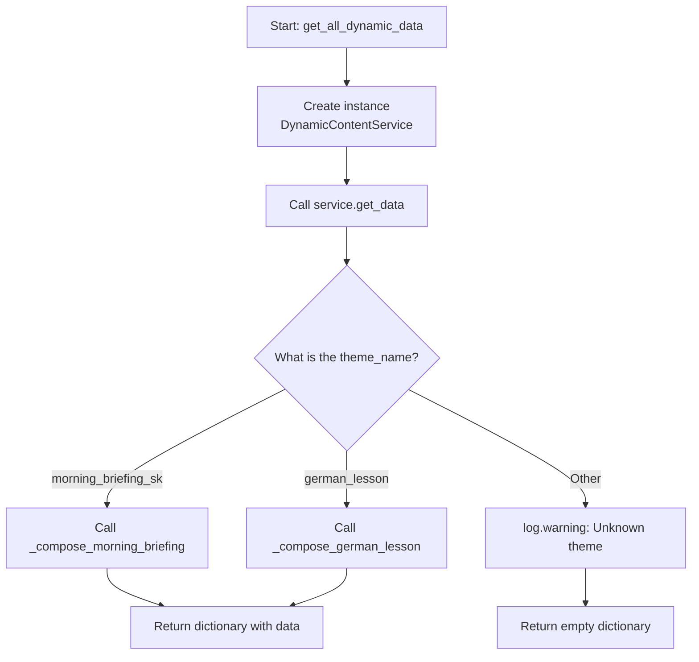
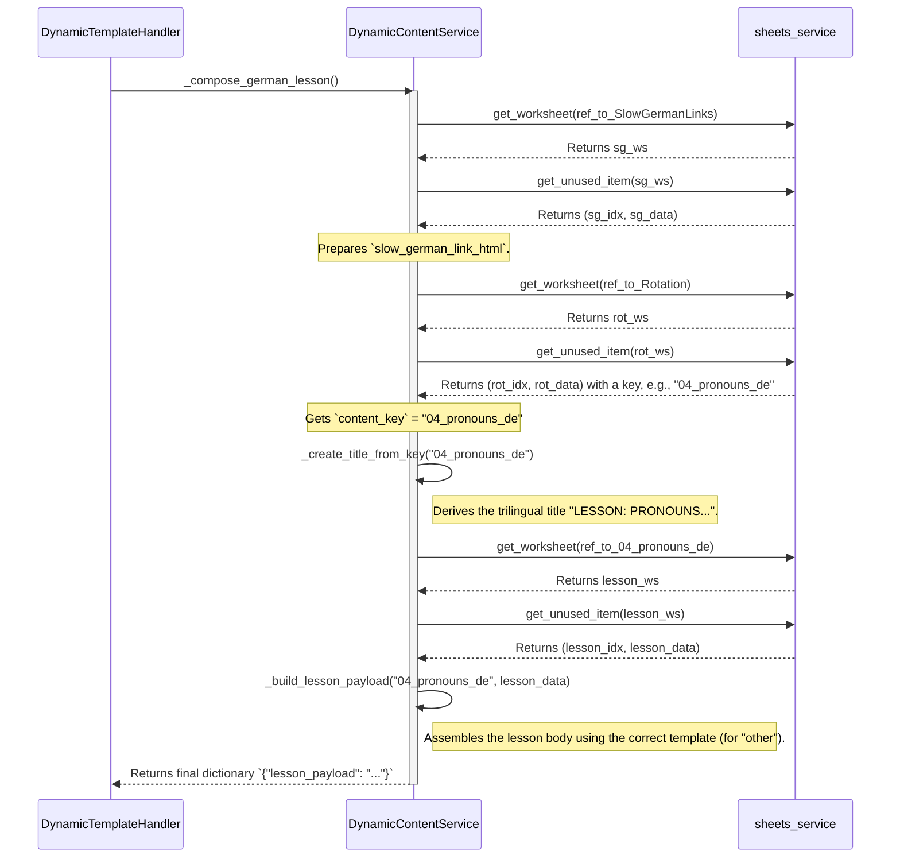

Of course. Here is the English translation of the detailed logic for `dynamic_content_service.py`.

---

# Detailed Logic: `dynamic_content_service.py`

This document provides an in-depth look at the internal logic of the `dynamic_content_service.py` module. This service acts as a "composer" for complex, dynamic themes (`llm_dynamic` and `dynamic_template`) that require data collection from multiple sources.

---

## 1. Architecture: Dispatcher and Composers

The service is designed as a **dispatcher** that delegates work to specialized "composing" methods based on the theme name.

-   **Main Entry Point:** The public function `get_all_dynamic_data()` creates an instance of the `DynamicContentService` class.
-   **Main Method:** The `get_data()` method within the class acts as a dispatcher. It looks at the `theme_name` and decides which private method to call.

---

## 2. Data Flow for `_compose_morning_briefing`

This method sequentially calls other helper methods to gather all the parts for the morning briefing. Each part is called only if it is configured in `config.json` under the `components` section.

1.  **Initialization:** Creates a base dictionary with default values to prevent `KeyError` exceptions.
2.  **Name Day and International Day:** Calls `_get_daily_info_from_sheet()`.
3.  **Weather:** Calls `_get_weather_forecast()`.
4.  **Rotating Content:** Calls `_get_rotating_content()`. This step is complex in itself:
    a. It fetches an unused row from the `Rotation` sheet to get a key (e.g., `historical_events`).
    b. Based on this key, it fetches an unused row from the corresponding data sheet (`HistoricalEvents`).
5.  **Daily Greeting:** Calls `_get_daily_greeting()`.
6.  **Output:** Returns a single large dictionary with all the collected data.

---

## 3. Data Flow for `_compose_german_lesson` (Logic for `dynamic_template`)

This method demonstrates the power of the rotation mechanism for selecting a lesson topic.

**Key points of the algorithm:**
1.  **Bonus Link:** First, a dynamic link to an audio lesson from `SlowGermanLinks` is fetched.
2.  **Category Selection:** The key for today's topic (e.g., `04_pronouns_de`) is fetched from the `Rotation` sheet.
3.  **Title Generation:** The correct trilingual title is automatically generated from this key.
4.  **Lesson Loading:** Based on the key, one unused row is fetched from the corresponding data sheet (`04_pronouns_de`).
5.  **Body Assembly:** The `_build_lesson_payload` method intelligently detects whether the topic is a verb or another part of speech and formats the data into a text block accordingly.
6.  **Combination:** The lesson body and the bonus link are combined into the final "payload," which is then passed to the formatting prompt.