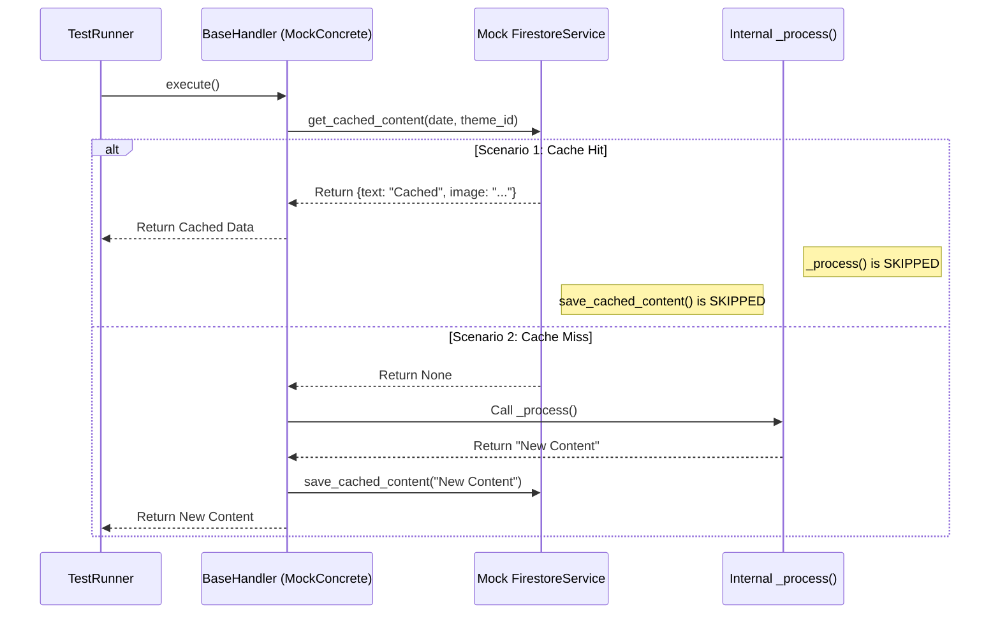

# Test Documentation: `test_caching_logic.py`

This document provides a detailed description and visualization of the test scenarios for the **Base Handler Caching Mechanism**. These tests verify the core logic responsible for reducing API costs by utilizing Firestore as a cache layer.

## Key Testing Tools

### 1. `pytest` Fixtures (`@pytest.fixture`)
*   **Concept:** Functions that prepare a consistent test environment.
*   **Usage:** We define a `MockConcreteHandler`. Since `BaseHandler` is an abstract class, we cannot instantiate it directly. The fixture creates a minimal concrete implementation that simulates the expensive `_process` method.

### 2. Mocking and Patching (`@patch`)
*   **Concept:** Replacing real external dependencies with controlled fake objects.
*   **Usage:** We patch `src.handlers._base.base_handler.firestore_service`. This allows us to simulate:
    *   **Cache Hit:** Firestore returning a valid document.
    *   **Cache Miss:** Firestore returning `None`.
    *   **Write Verification:** Ensuring `save_cached_content` is called only when necessary.

---

## Test Scenarios

### Scenario 1: `test_execute_returns_cached_content_on_hit`

**Objective:** Verify that if valid content exists in Firestore, the handler returns it immediately without triggering the expensive processing logic.
**Logic:**
1.  Mock `get_cached_content` to return a dictionary (e.g., `{'text': '...', 'image_url': '...'}`).
2.  Call `handler.execute()`.
3.  **Assert:** The returned data matches the mock.
4.  **Critical Check:** Ensure `_process()` was **NOT** called.
5.  **Critical Check:** Ensure `save_cached_content()` was **NOT** called.

### Scenario 2: `test_execute_processes_and_saves_on_miss`

**Objective:** Verify that if the cache is empty, the handler generates new content and saves it for future use.
**Logic:**
1.  Mock `get_cached_content` to return `None`.
2.  Call `handler.execute()`.
3.  **Assert:** The returned data comes from the `_process()` method.
4.  **Critical Check:** Ensure `save_cached_content()` **WAS** called with the correct parameters.

---

## Sequence Diagram (Mermaid)

--- END OF FILE doc_test_caching_logic.md ---

