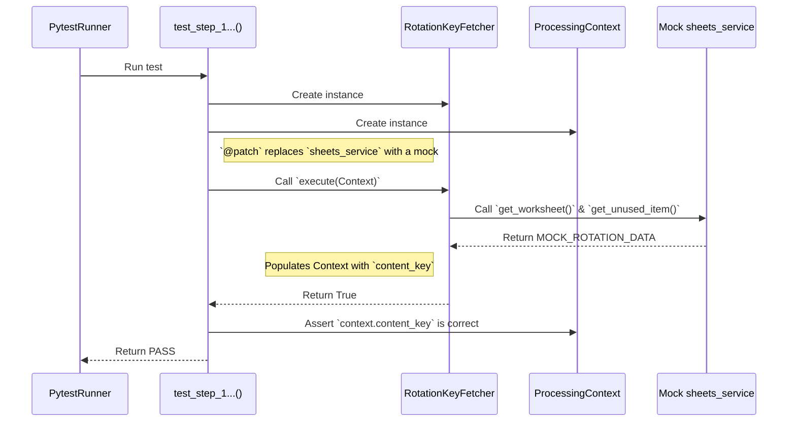
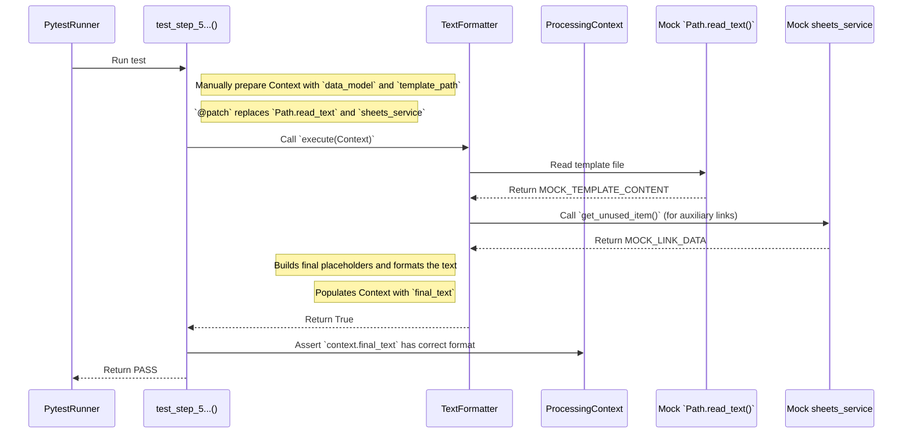

Samozrejme. Tu je kompletný preklad dokumentu `doc_test_dynamic_template_handler.md` do anglického jazyka.

---

# Test Documentation: `test_dynamic_template_handler.py` (v2)

This document provides a detailed description and visualization of the test scenarios for the **unit tests** that verify the **individual logical steps within the `DynamicTemplateHandler` pipeline**. This handler is responsible for processing the `german_lesson` theme.

## Key Testing Tools

### 1. `pytest` Fixtures (`@pytest.fixture`)

*   **What it is:** Functions that `pytest` runs before (and sometimes after) test functions. Their main purpose is to **prepare and provide data, objects, or state** that the tests need.
*   **How we use it:** The `handler_instance` fixture creates a new, clean instance of `DynamicTemplateHandler` for each test, ensuring that tests are isolated from each other.

### 2. Mocking and Patching (`@patch`)

*   **What it is:** A technique where we temporarily **replace a real piece of code** (e.g., a call to the Google Sheets API) with a **fake substitute (a mock)** that returns predefined data.
*   **Why it's important:** It allows us to test our logic without depending on the internet, making the tests extremely fast and reliable.

#### Detailed Overview of Patches Used in Tests:

*   **`@patch("src.handlers.template.dynamic_template_handler.sheets_service")`**
    *   **What it patches:** Replaces the **entire `sheets_service` module** that `DynamicTemplateHandler` imports. This allows us to control the behavior of all its functions (`get_worksheet`, `get_unused_item`, `mark_item_as_used`) and simulate responses from Google Sheets.

*   **`@patch("src.handlers.template.dynamic_template_handler.Path.read_text")`**
    *   **What it patches:** Replaces the `read_text` method on the `Path` class from the `pathlib` module. This isolates the test from the actual file system and allows us to substitute template content without needing a real file on disk.

*   **`@patch("src.handlers.template.dynamic_template_handler.ProcessingPipeline.run")`**
    *   **What it patches:** Replaces the `run` method on the `ProcessingPipeline` class. This is used in the final orchestration test, where we are no longer interested in the internal logic of the pipeline (which was tested in other tests), but only that it was called correctly.

---

## Test Description

Each test verifies a single, separate step (`ProcessingStep`) from the handler's pipeline.

### Scenario 1: `test_step_rotation_key_fetcher`

**Objective:** To verify that the `RotationKeyFetcher` step correctly loads the key from the "rotation" sheet.
**Method:** The `sheets_service` is mocked to return a predefined row. The test asserts that the context (`ProcessingContext`) is correctly populated with the `rotation_idx` and `content_key` values after the step is executed.

### Scenario 2: `test_step_template_selector`

**Objective:** To verify that the `TemplateSelector` step correctly selects the template path based on the key.
**Method:** The `content_key` is manually set in the context. The test asserts that the `context.template_path` attribute contains the correct path.

### Scenario 3: `test_step_lesson_data_fetcher`

**Objective:** To verify that the `LessonDataFetcher` step correctly loads data from the data sheet.
**Method:** The `sheets_service` is mocked. The test asserts that the context is populated with the correct data.

### Scenario 4: `test_step_data_model_builder`

**Objective:** To verify that the `DataModelBuilder` step correctly creates the data model (`GermanTerm` or `GermanVerb`).
**Method:** Data is manually set in the context. The test asserts that `context.data_model` is an instance of the correct class.

### Scenario 5: `test_step_text_formatter`

**Objective:** To verify that the `TextFormatter` step correctly assembles the final text.
**Method:** All dependencies (file reading via `Path.read_text`, `sheets_service` for auxiliary links) are mocked. The test asserts that `context.final_text` contains the correctly formatted string.

### Scenario 6: `test_orchestration_process_method`

**Objective:** To verify that the main `_process` method correctly runs the entire pipeline.
**Method:** The entire pipeline (`ProcessingPipeline.run`) is replaced with a mock. The test asserts that `_process` calls `pipeline.run` and returns its results.

---

## Sequence Diagrams (Mermaid)

### Diagram for `test_step_rotation_key_fetcher`

### Diagram for `test_step_text_formatter`

