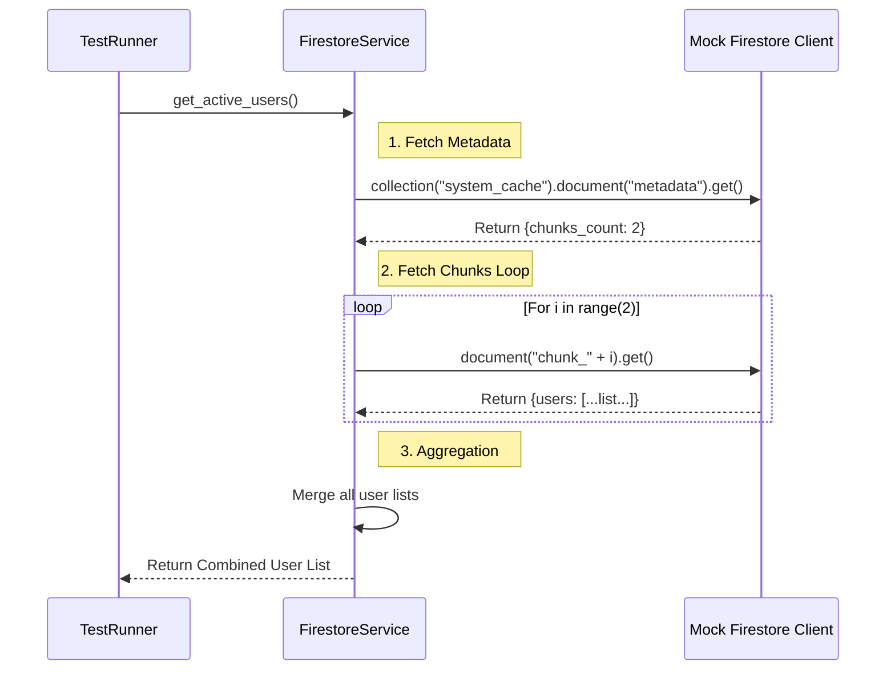

# Test Documentation: `test_firestore_service.py`

This document details the tests for the **Firestore Service**, specifically focusing on the **Chunked Snapshot Reconstruction** logic. This mechanism is critical for performance when handling a large number of users.

## Key Testing Tools

### 1. Mocking the Firebase Admin SDK
*   Since we cannot connect to a real Google Cloud instance during unit tests, we mock the `firebase_admin` and `firestore` libraries entirely.

### 2. `side_effect` for Sequential Calls
*   **Challenge:** The code calls `.document().get()` multiple times in a loop (first for metadata, then for each chunk).
*   **Solution:** We use `mock.side_effect = [doc1, doc2, doc3]`. This tells the mock to return `doc1` on the first call, `doc2` on the second, etc., simulating the retrieval of a sequence of documents.

---

## Test Scenarios

### Scenario 1: `test_get_active_users_reconstructs_from_snapshot`

**Objective:** Verify that the service correctly reassembles a full user list from multiple fragmented documents (chunks) stored in Firestore.
**Logic:**
1.  **Mock Metadata:** Simulate a metadata document that says `chunks_count: 2`.
2.  **Mock Chunk 0:** Simulate a document containing a list `[User A]`.
3.  **Mock Chunk 1:** Simulate a document containing a list `[User B]`.
4.  **Execution:** Call `get_active_users(force_refresh=False)`.
5.  **Assert:** The returned list is `[User A, User B]`.
6.  **Assert:** The `where()` method (which represents a live, expensive database query) was **NOT** called.

---

## Sequence Diagram (Mermaid)

--- END OF FILE doc_test_firestore_service.md ---