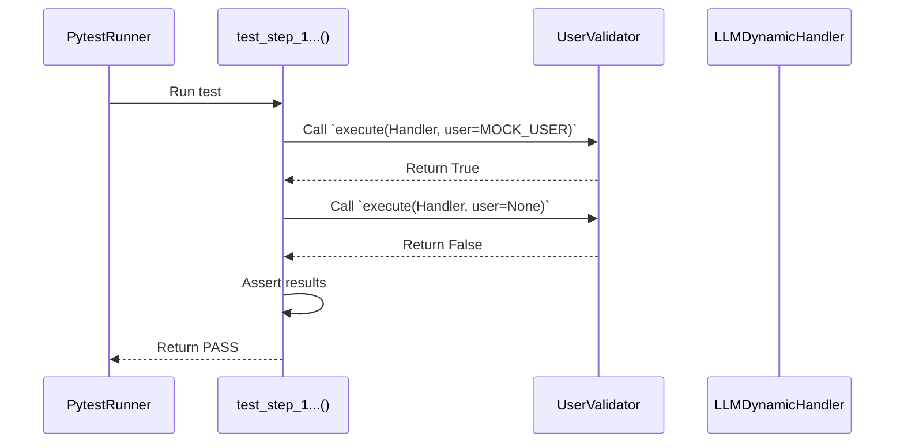
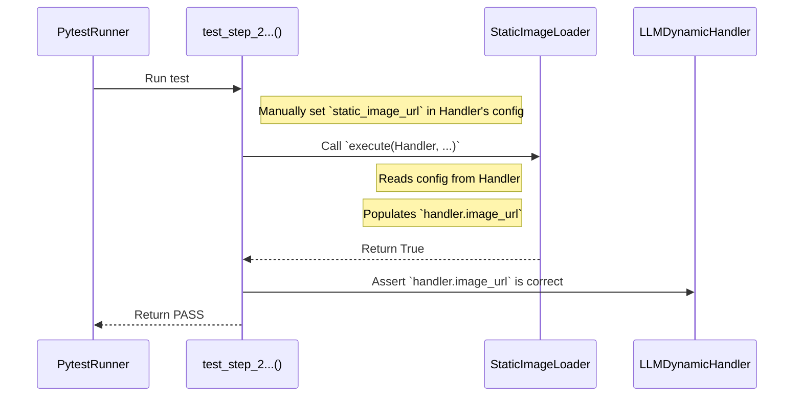
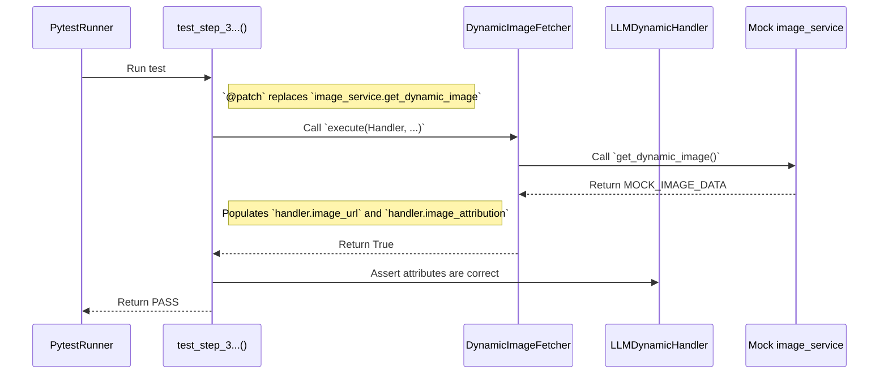
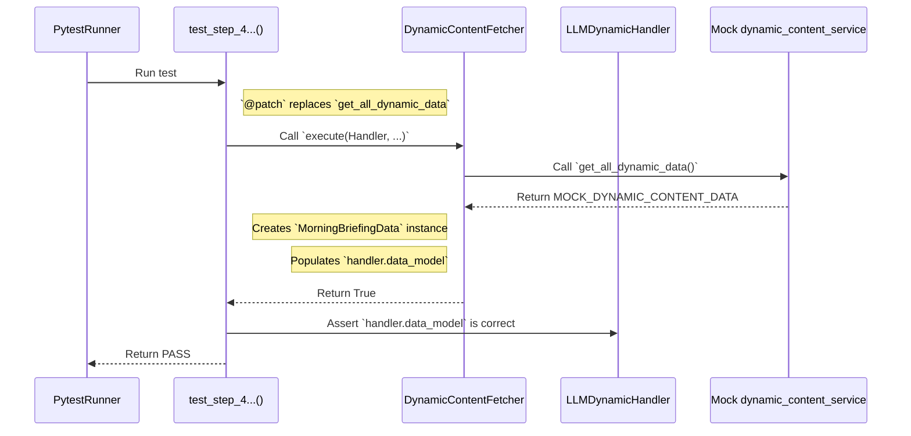
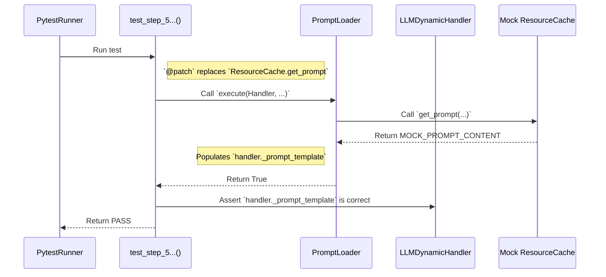
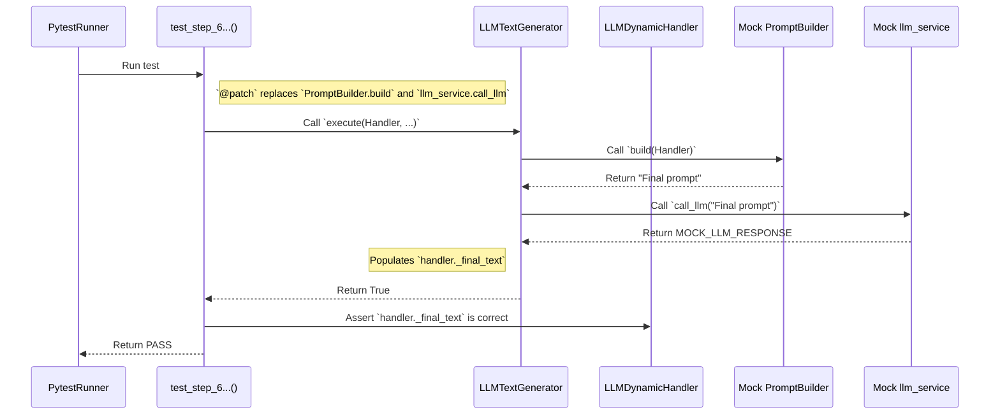
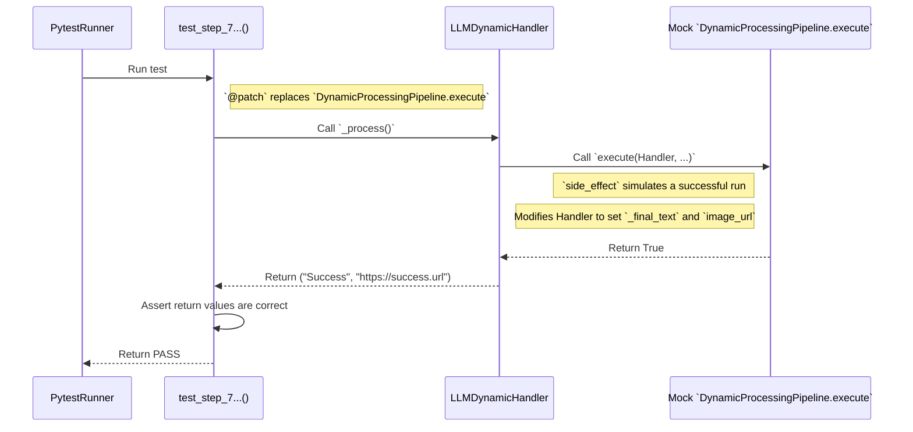

# Test Documentation: `test_llm_dynamic_handler.py` (v2)

This document provides a detailed description and visualization of **every** test scenario for the unit tests that verify the individual logical steps within the `LLMDynamicHandler` pipeline. This handler is responsible for processing the `morning_briefing_sk` topic.

## Key Testing Tools

### 1. `pytest` Fixtures (`@pytest.fixture`)

*   **What it is:** Functions that prepare and provide data or objects for tests.
*   **How we use them:** The `handler_instance` fixture creates a new, clean instance of `LLMDynamicHandler` for each test, ensuring that the tests are mutually independent.

### 2. Mocking and Patching (`@patch`)

*   **What it is:** A technique where we temporarily **replace a real piece of code** with its **fake imitation (mock)**.
*   **Why it is important:** This allows us to test our logic without relying on the internet or files on the disk, making the tests extremely fast and reliable.

#### Detailed Overview of Patches Used in Tests:

*   **`@patch("...image_service.get_dynamic_image")`**
    *   **What it patches:** Replaces the `get_dynamic_image` function, isolating the test from calls to the Unsplash API.

*   **`@patch("...dynamic_content_service.get_all_dynamic_data")`**
    *   **What it patches:** Replaces the key function that assembles data for the morning briefing. This allows us to test the handler without relying on the complex logic in `dynamic_content_service`.

*   **`@patch("...ResourceCache.get_prompt")`**
    *   **What it patches:** Replaces the `get_prompt` method on the `ResourceCache` class, isolating the test from real file reading from the disk.

*   **`@patch("...llm_service.call_llm")`**
    *   **What it patches:** Replaces the `call_llm` function, isolating the test from calls to the LLM API (e.g., Groq).

*   **`@patch("...PromptBuilder.build")`**
    *   **What it patches:** Replaces the `build` method on the `PromptBuilder` class, which allows us to test the `LLMTextGenerator` in isolation.

*   **`@patch("...DynamicProcessingPipeline.execute")`**
    *   **What it patches:** Replaces the `execute` method on the `DynamicProcessingPipeline` class in the orchestration test, where we are only interested in verifying that it was called correctly.

---

## Test Scenarios & Diagrams

### 1. `test_step_user_validator`
**Objective:** Verify that the `UserValidator` step correctly requires the presence of the `user` object.

### 2. `test_step_static_image_loader`
**Objective:** Verify that the `StaticImageLoader` step correctly loads the static image URL from the configuration.

### 3. `test_step_dynamic_image_fetcher`
**Objective:** Verify that the `DynamicImageFetcher` step correctly calls `image_service`.

### 4. `test_step_dynamic_content_fetcher`
**Objective:** Verify that the `DynamicContentFetcher` step correctly creates the data model.

### 5. `test_step_prompt_loader`
**Objective:** Verify that the `PromptLoader` step correctly loads the prompt content.

### 6. `test_step_llm_text_generator`
**Objective:** Verify that the `LLMTextGenerator` step correctly calls `llm_service`.

### 7. `test_orchestration_process_method`
**Objective:** Verify that the main `_process` method correctly executes the entire pipeline.

