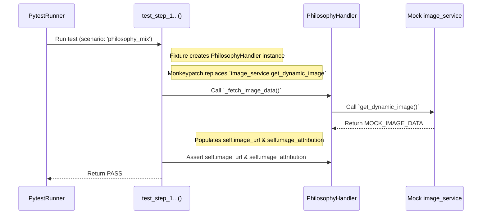
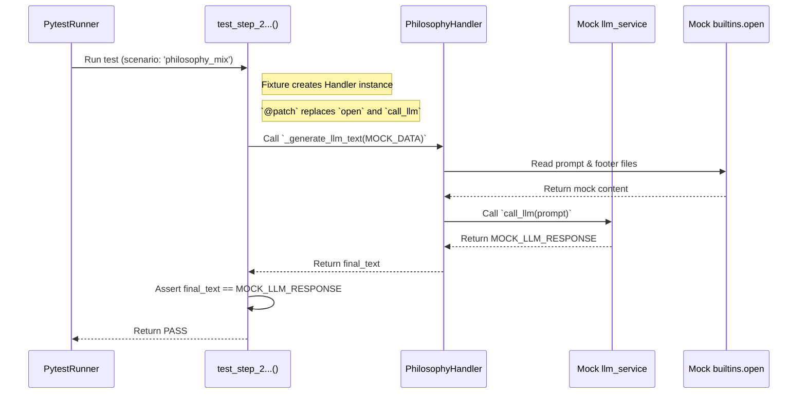
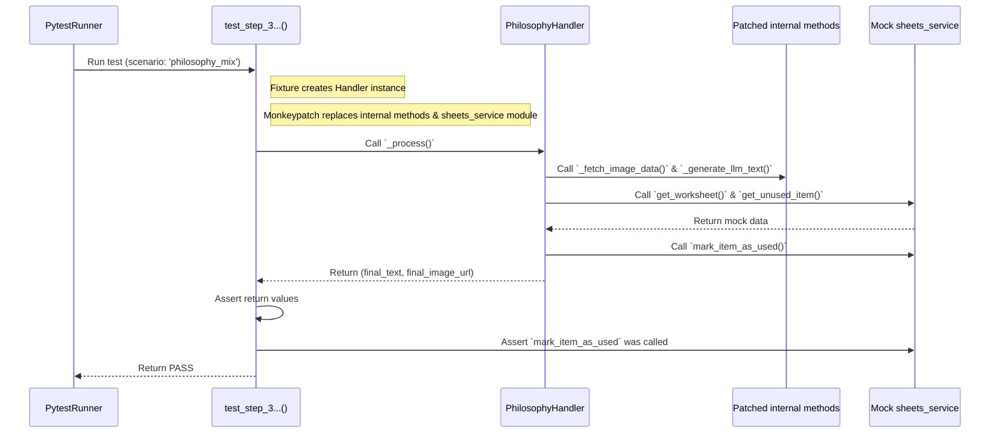

# Test Documentation: `test_llm_static_handler.py` (v4)

This document provides a detailed description and visualization of the test scenarios for **unit tests** that verify **individual logical steps within the `LLMStaticBaseHandler`**. The tests are parameterized to cover all relevant topics that inherit from this base class (`bible_sk`, `philosophy_mix`, `novy_zakon_sk`, `stary_zakon_sk`).

## Key Testing Tools

### 1. Parameterization (`@pytest.mark.parametrize`)

*   **What it is:** This `pytest` decorator allows the **same test function to be run multiple times with different input data**.
*   **How we use it:** At the level of the entire test class, we have defined a list of scenarios (`TEST_SCENARIOS`). `pytest` automatically runs all tests in the class for every single scenario, effectively testing four different topics using a single test code block.

### 2. `pytest` Fixtures (`@pytest.fixture`)

*   **What it is:** Functions that prepare and provide data or objects for tests.
*   **How we use them:**
    *   `handler_instance`: Dynamically creates an instance of the correct handler (`BibleHandler`, `PhilosophyHandler`, etc.) based on the parameters from the current scenario.
    *   `theme_config`: Prepares the minimum necessary configuration for the currently tested theme.

### 3. Mocking and Patching (`@patch`, `monkeypatch`)

*   **What it is:** A technique where we temporarily **replace a real piece of code** (e.g., an API call) with its **fake imitation (mock)**.
*   **Why it is important:** This allows us to test our logic without reliance on the internet or external files, making the tests extremely fast and reliable.

#### Detailed Overview of Patches Used in Tests:

*   **`monkeypatch.setattr("src.handlers._base.llm_static_base.image_service.get_dynamic_image", ...)`**
    *   **What it patches:** Replaces the `get_dynamic_image` function directly in the module where `LLMStaticBaseHandler` imports and uses it, isolating the test from calls to the Unsplash API.

*   **`@patch("builtins.open")`**
    *   **What it patches:** Replaces the global built-in function `open`, which is used for reading files, isolating the test from the actual file system.

*   **`@patch("src.handlers._base.llm_static_base.llm_service.call_llm")`**
    *   **What it patches:** Replaces the `call_llm` function in the module where `LLMStaticBaseHandler` uses it, isolating the test from calls to the LLM API (e.g., Groq).

*   **`@patch("src.handlers._base.llm_static_base.sheets_service")`**
    *   **What it patches:** Replaces the **entire module** `sheets_service` with a single mock object, allowing us to control the behavior of all its functions (`get_worksheet`, `get_unused_item`, `mark_item_as_used`) simultaneously.

*   **`monkeypatch.setattr(handler_instance, "_fetch_image_data", ...)`**
    *   **What it patches:** Replaces an **internal method** on the already existing `handler_instance`, which is useful in the orchestration test where we do not need to retest its detailed logic.

---

## Test Description

### Scenario 1: `test_step_1_fetch_image_data`

**Objective:** Verify that the `_fetch_image_data` method correctly calls `image_service` and correctly populates the attributes on the handler instance.
**Method:** `monkeypatch` is used to replace `image_service.get_dynamic_image` with a mock. Subsequently, the state of the handler instance is verified.

### Scenario 2: `test_step_2_generate_llm_text`

**Objective:** Verify that the `_generate_llm_text` method correctly assembles the final message text.
**Method:** The `@patch` decorator is used to replace the functions `builtins.open` and `llm_service.call_llm` with mocks. Subsequently, it is verified whether the resulting string is correctly assembled.

### Scenario 3: `test_step_3_process_orchestration`

**Objective:** Verify that the orchestration method `_process` correctly calls the individual sub-methods.
**Method:** `monkeypatch` is used to replace internal methods and the entire `sheets_service` module. The test verifies that `_process` calls them and correctly calls `sheets_service.mark_item_as_used` at the end.

---

## Sequence Diagrams (Mermaid) - Example for Scenario `philosophy_mix`

### Diagram for `test_step_1_fetch_image_data`

### Diagram for `test_step_2_generate_llm_text`

### Diagram for `test_step_3_process_orchestration`

