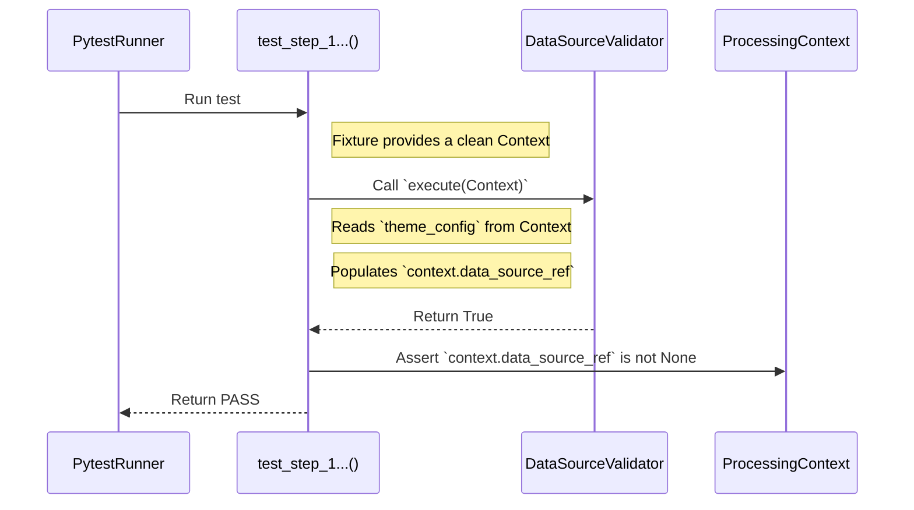
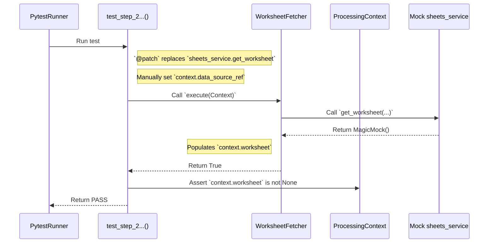
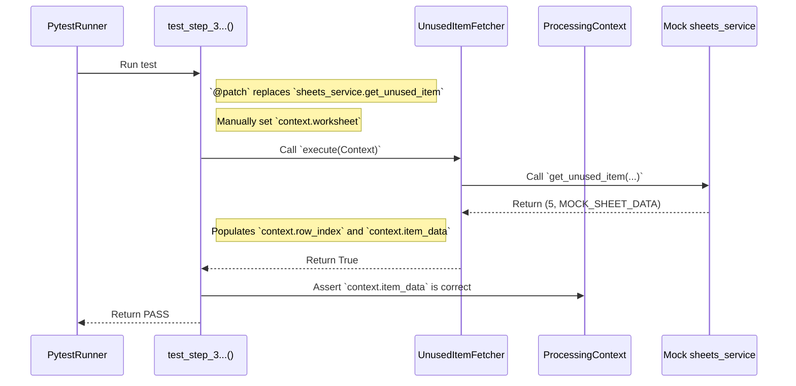
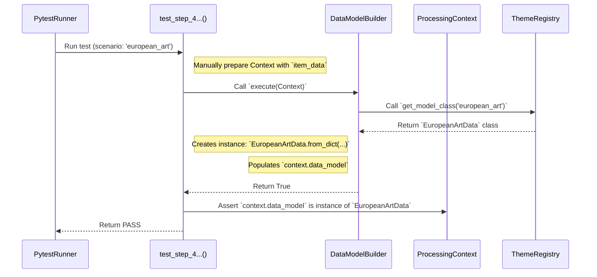
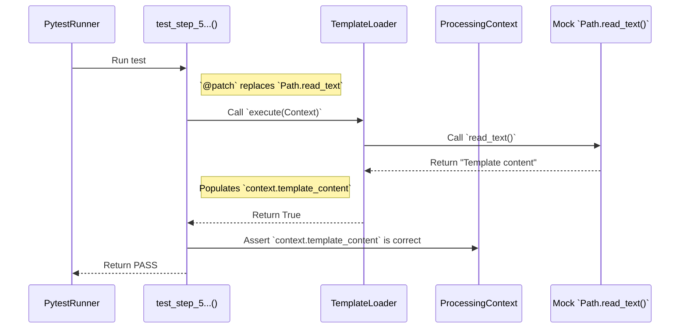
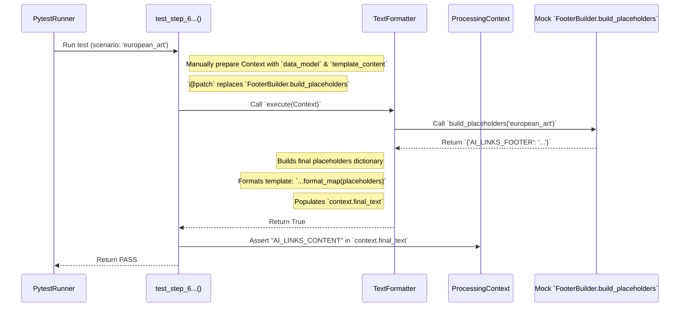
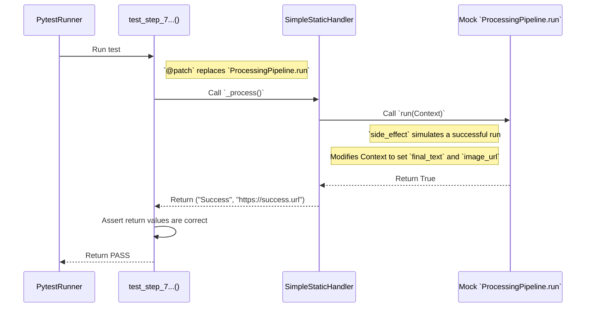

# Test Documentation: `test_simple_static_handler.py`

This document provides a detailed description and visualization of the test scenarios for **unit tests** that verify **individual logical steps within the `SimpleStaticHandler` pipeline**. The tests are parameterized to cover all relevant topics that this handler uses (`european_art`, `family_photo`).

## Key Testing Tools

### 1. Parameterization (`@pytest.mark.parametrize`)

*   **What it is:** This `pytest` decorator allows the **same test function to be run multiple times with different input data**.
*   **How we use it:** At the level of the entire test class `TestSimpleStaticPipelineSteps`, we have defined a list of scenarios (`TEST_SCENARIOS`). Each scenario contains the topic name, the corresponding data model class, mocked data, and a flag indicating whether the topic should include a footer. `pytest` automatically runs all tests in the class for every single scenario, effectively testing two different topics (including a regression test for `family_photo`) using a single test code block.

### 2. `pytest` Fixtures (`@pytest.fixture`)

*   **What it is:** Functions that prepare and provide data or objects for tests.
*   **How we use them:**
    *   `context_instance`: Creates a new, clean instance of `ProcessingContext` for each test.
    *   `theme_config`: Prepares the minimum necessary configuration for the currently tested theme.

### 3. Mocking and Patching (`@patch`)

*   **What it is:** A technique where we temporarily **replace a real piece of code** with its **fake imitation (mock)**.
*   **Why it is important:** This allows us to test our logic without reliance on the internet or files on the disk, making the tests extremely fast and reliable.

#### Detailed Overview of Patches Used in Tests:

*   **`@patch("...sheets_service.get_worksheet")` and `@patch("...sheets_service.get_unused_item")`**
    *   **What it patches:** Replaces individual functions in the `sheets_service` module. This isolates the test from real calls to the Google Sheets API and allows us to precisely control what data is "loaded" from the spreadsheet.

*   **`@patch("...Path.read_text")`**
    *   **What it patches:** Replaces the `read_text` method on the `Path` class. This isolates the test from the actual file system and allows us to substitute the template content.

*   **`@patch("...FooterBuilder.build_placeholders")`**
    *   **What it patches:** Replaces the `build_placeholders` method on the `FooterBuilder` class. This allows us to test `TextFormatter` in isolation, without relying on `FooterBuilder` to function correctly.

*   **`@patch("...ProcessingPipeline.run")`**
    *   **What it patches:** Replaces the `run` method on the `ProcessingPipeline` class. It is used in the orchestration test, where we are no longer interested in the internal logic of the pipeline, but only that it was called correctly.

---

## Test Description

Each test verifies one standalone step (`ProcessingStep`) of the handler's pipeline.

### Scenario 1: `test_step_data_source_validator`
**Objective:** Verify that the `DataSourceValidator` step correctly validates the configuration.

### Scenario 2: `test_step_worksheet_fetcher`
**Objective:** Verify that the `WorksheetFetcher` step correctly calls `sheets_service`.

### Scenario 3: `test_step_unused_item_fetcher`
**Objective:** Verify that the `UnusedItemFetcher` step correctly loads the data.

### Scenario 4: `test_step_data_model_builder`
**Objective:** Verify that the `DataModelBuilder` step correctly selects and creates the data model (`EuropeanArtData` or `FamilyPhotoData`) according to the topic name.

### Scenario 5: `test_step_template_loader`
**Objective:** Verify that the `TemplateLoader` step correctly loads the template content.

### Scenár 6: `test_step_text_formatter`
**Objective:** Verify that the `TextFormatter` step correctly assembles the final text and **correctly applies the footer logic** (adds it for `european_art`, but does not add it for `family_photo`).

### Scenario 7: `test_orchestration_process_method`
**Objective:** Verify that the main `_process` method correctly executes the entire pipeline.

---

## Test Scenarios & Diagrams

### 1. `test_step_data_source_validator`
**Objective:** Verify that the `DataSourceValidator` step correctly validates the presence of `data_source` in the configuration and inserts it into the context.

### 2. `test_step_worksheet_fetcher`
**Objective:** Verify that the `WorksheetFetcher` step correctly calls `sheets_service` to obtain the worksheet.

### 3. `test_step_unused_item_fetcher`
**Objective:** Verify that the `UnusedItemFetcher` step correctly loads an unused data row.

### 4. `test_step_data_model_builder`
**Objective:** Verify that the `DataModelBuilder` step correctly selects and creates the data model (`EuropeanArtData` or `FamilyPhotoData`).

### 5. `test_step_template_loader`
**Objective:** Verify that the `TemplateLoader` step correctly loads the template content from the disk.

### 6. `test_step_text_formatter`
**Objective:** Verify that the `TextFormatter` step correctly assembles the final text and applies the footer logic.

### 7. `test_orchestration_process_method`
**Objective:** Verify that the main `_process` method correctly executes the entire pipeline and returns its results.

