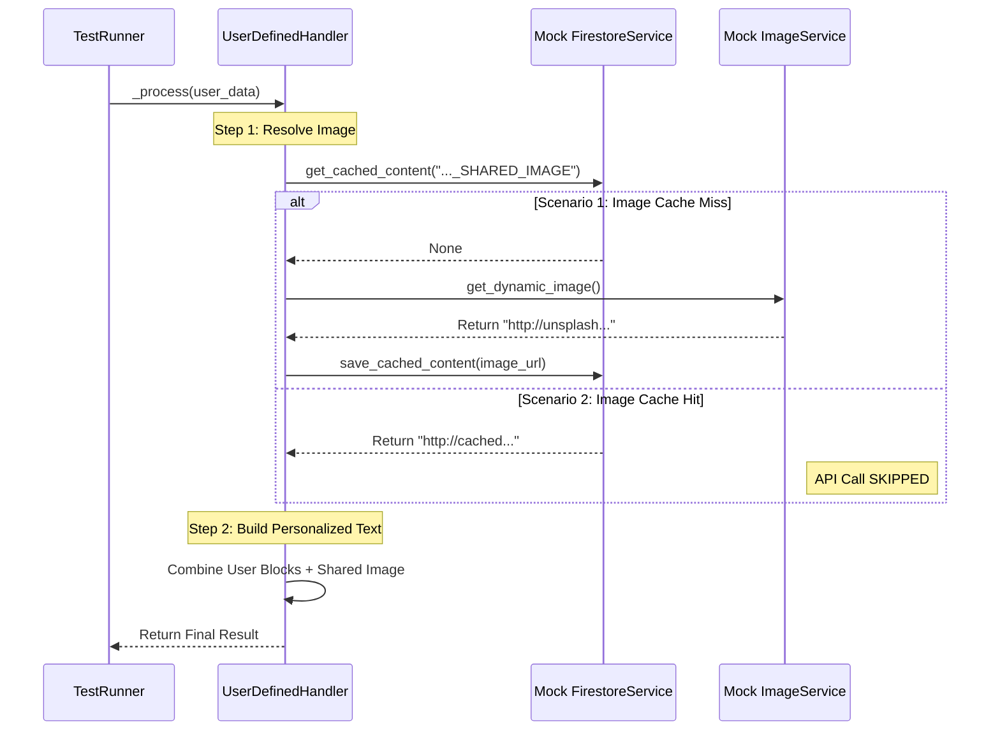

# Test Documentation: `test_user_defined_handler.py`

This document details the tests for the **User Defined Handler**, which manages the "User Reminder" theme. This handler uses a unique **Hybrid Caching Strategy**: text is personalized (never cached), but the image is shared (cached).

## Key Testing Tools

### 1. Mocking External Services
*   **`image_service`:** We patch this to prevent real calls to the Unsplash API.
*   **`firestore_service`:** We patch this to control the state of the *Image Cache*.

### 2. Specific Configuration
*   The handler is initialized with `use_cache=False` in the standard configuration, but the internal logic explicitly checks the cache for the image component.

---

## Test Scenarios

### Scenario 1: `test_process_generates_text_and_caches_image_on_miss`

**Context:** Represents the **first user of the day** triggering the reminder.
**Objective:** Verify that the system fetches a fresh image from the API and caches it globally.
**Logic:**
1.  Mock Firestore to return `None` (Cache Miss for image).
2.  Mock ImageService to return a new URL.
3.  **Assert:** Text contains user-specific data.
4.  **Assert:** `get_dynamic_image` was called.
5.  **Assert:** `save_cached_content` was called with a specific key (e.g., `user_reminder_SHARED_IMAGE`).

### Scenario 2: `test_process_uses_cached_image_on_hit`

**Context:** Represents the **second (and subsequent) users** of the day.
**Objective:** Verify that the system reuses the image fetched for the first user, saving API costs.
**Logic:**
1.  Mock Firestore to return a valid image object (Cache Hit).
2.  **Assert:** Text contains user-specific data.
3.  **Critical Check:** `get_dynamic_image` (API call) was **NOT** called.
4.  **Critical Check:** `save_cached_content` was **NOT** called.

---

## Sequence Diagram (Mermaid)

--- END OF FILE doc_test_user_defined_handler.md ---

