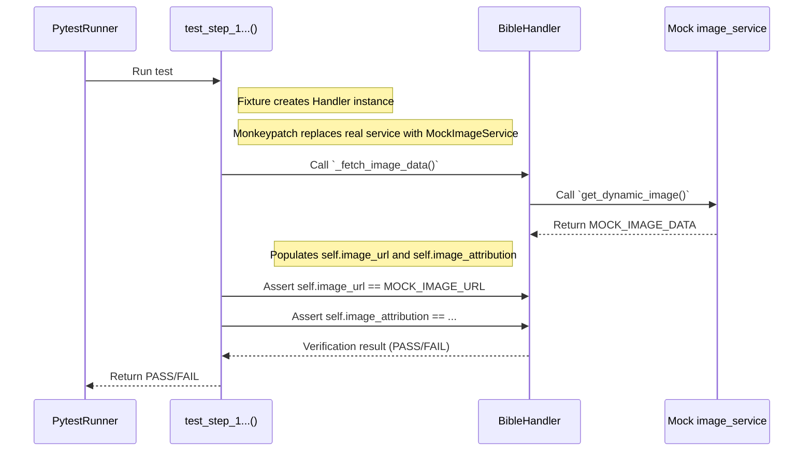
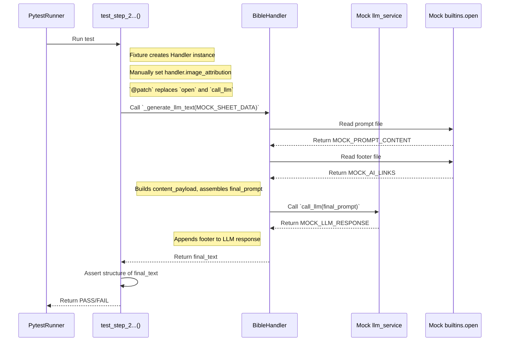
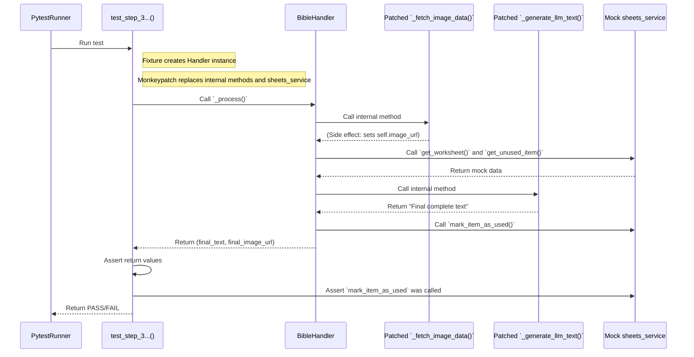

# Test Documentation: 

This document provides a detailed description and visualization of the test scenarios for **unit tests** that verify **individual logical steps within the `LLMStaticBaseHandler`** using `BibleHandler` as a specific implementation.

## Key Testing Tools

These tests intensely utilize two key tools from the `pytest` ecosystem to achieve isolation and repeatability.

### 1. `pytest` Fixtures (`@pytest.fixture`)

*   **What it is:** Fixtures are functions that `pytest` runs before (and sometimes after) test functions. Their main purpose is to **prepare and provide data, objects, or state** that the tests need.
*   **How we use them:**
    *   `handler_instance`: This fixture creates a new, clean instance of `BibleHandler` for each test, ensuring that the tests are mutually independent.
    *   `autouse=True` (in `conftest.py`): Fixtures with this parameter run automatically for every test, such as our `telegram_mocker`, which ensures that a real message is never sent.

### 2. Mocking and Patching (`@patch`, `monkeypatch`)

*   **What it is:** Mocking (or patching) is a technique where we temporarily **replace a real piece of code** (a function, class, object) with its **fake imitation (mock)**. This mock behaves as we instruct it (e.g., returns predefined data) and records how it was used.
*   **Why it is important:** It allows us to test our logic without having to connect to the internet, communicate with real APIs (Google, Unsplash, LLM), or read files from the disk. The tests are thus extremely fast, reliable, and run anywhere.

#### Detailed Process of Patching with `@patch`

The `@patch` decorator is an elegant way to isolate the tested code. Let's look at the example ` @patch("src.handlers._base.llm_static_base.llm_service.call_llm")`:

1.  **Target to "patch":** The string `"src.handlers._base.llm_static_base.llm_service.call_llm"` tells Python: "Find the module `src.handlers._base.llm_static_base`. In it, find the object `llm_service`, and on it, find the attribute (function) `call_llm`."

2.  **Temporary Replacement:** As soon as the test `test_step_2_generate_llm_text` starts, `@patch` finds this function and replaces it with a new `MagicMock` object. The original function is safely stored aside.

3.  **Insertion of the Mock into the Test:** This newly created `MagicMock` object is then inserted as an argument into the test function. In our case, it is the argument `mock_call_llm`. This allows us to work with this mock within the test body.

4.  **Test Execution:**
    *   In the test, we set the mock's behavior: `mock_call_llm.return_value = MOCK_LLM_RESPONSE`. This says: "When anyone calls you, regardless of the arguments, return the string `MOCK_LLM_RESPONSE`."
    *   Then we call the tested function: `handler_instance._generate_llm_text(...)`.
    *   When the code inside `_generate_llm_text` reaches the line where `llm_service.call_llm(...)` is called, it does not actually call the real LLM, but our mock, which immediately returns the pre-prepared response.
    *   At the end of the test, we verify the interaction: `mock_call_llm.assert_called_once()`. This checks whether our tested function actually called the (now mocked) function `call_llm` exactly once.

5.  **Automatic Cleanup:** As soon as the test finishes (successfully, unsuccessfully, or with an error), `@patch` automatically restores everything to its original state. The original `call_llm` function is returned to its place, as if nothing happened. This guarantees that this test will not affect any subsequent tests.

**Key Concept: "Where to patch?"**
The most common mistake is an incorrectly specified path. The rule is: **You patch where the object is used (where it is imported), not where it is defined.**

*   **Example:**
    *   File `api.py`: `def get_data(): ...`
    *   File `logic.py`: `from api import get_data; def process_data(): result = get_data()`
    *   If you want to test `process_data` in `logic.py` and mock `get_data`, you must patch `'logic.get_data'`, not `'api.get_data'`. This is because the `logic` module created its own local reference to this function upon import.

Our test does this correctly: `LLMStaticBaseHandler` imports and uses `llm_service`, which is why the patching path is `src.handlers._base.llm_static_base.llm_service.call_llm`.

---

## Test Description

### Scenario 1: `test_step_1_fetch_image_data`

**Objective:** Verify that the `_fetch_image_data` method correctly calls the external `image_service` and correctly populates the attributes on the handler instance.
**Method:** `monkeypatch` (see section above) is used to replace `image_service.get_dynamic_image` with a mock that returns predefined data. Subsequently, the state of the handler instance is verified.

### Scenario 2: `test_step_2_generate_llm_text`

**Objective:** Verify that the `_generate_llm_text` method correctly assembles the final message text.
**Method:** The `@patch` decorator (see section above) is used to replace the functions `builtins.open` and `llm_service.call_llm` with mocks that return predefined content. Subsequently, it is verified whether the resulting string is correctly assembled.

### Scenario 3: `test_step_3_process_orchestration`

**Objective:** Verify that the orchestration method `_process` correctly calls the individual sub-methods.
**Method:** `monkeypatch` is used to replace the internal methods `_fetch_image_data` and `_generate_llm_text`, as they have already been tested separately. The test focuses on verifying that `_process` calls them and correctly calls `sheets_service.mark_item_as_used` at the end.

---

## Sequence Diagrams (Mermaid)

### Diagram for `test_step_1_fetch_image_data`

### Diagram for `test_step_2_generate_llm_text`

### Diagram for `test_step_3_process_orchestration`

